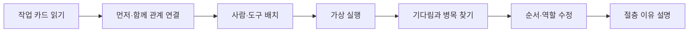

# Workflow Bottleneck Center

> 한국어 서비스명: **작업 순서 병목 해결소**  
> 문서 상태: 구현 완료 검토본 · 2026-08-28 갱신
> 작성일: 2026-08-26

## 1. 프로젝트 개요

| 항목 | 설계 내용 |
|---|---|
| 대상 | 초등 5~6학년 |
| 교과 | 실과·정보 |
| 핵심 질문 | 먼저 해야 하는 일과 함께 할 수 있는 일을 구분하면 전체 작업 시간을 어떻게 줄일 수 있을까요? |
| 한 차시 권장 시간 | 30~40분 |
| 실행 형태 | 정해진 가상 과제를 다루는 정적 시뮬레이션 |
| 핵심 산출물 | 선행 관계도, 작업 시간표, 병목 진단과 수정 이유 |

학생은 여러 작업의 순서를 무조건 빠르게 배열하는 대신, `먼저 끝나야 시작 가능한 일`, `동시에 할 수 있는 일`, `한 번에 한 팀만 쓸 수 있는 도구`를 구분합니다. 실행 결과의 기다림 구간을 관찰하고 병목을 찾아 더 안전하고 협력적인 작업 흐름으로 수정합니다.

## 2. 설계 원칙

- 가장 빠른 시간 하나만 정답으로 채점하지 않습니다.
- 안전·품질·역할 공정성을 어기며 시간을 줄이는 선택은 성공으로 인정하지 않습니다.
- 의존 관계, 작업 시간, 제한 자원을 명시하여 숨은 규칙 맞히기가 되지 않게 합니다.
- 인간의 노동을 숫자로만 최적화하지 않고 도움 요청·역할 교대·휴식의 의미를 포함합니다.
- 실제 산업 공정의 위험한 장비나 아동 노동을 연상시키는 사례를 사용하지 않습니다.

## 3. 교육과정 연계와 학습 목표

- `[6실05-01]`: 생활 속 문제를 해결하는 알고리즘을 다양한 방법으로 표현하기
- 절차적 사고, 협력적 문제 해결, 자원 관리의 실과 확장 활동

| 수준 | 학습 목표 |
|---|---|
| 이해 | 선행 작업, 병렬 작업, 제한 자원의 뜻을 사례로 설명합니다. |
| 적용 | 작업 카드의 조건에 따라 가능한 순서를 구성합니다. |
| 분석 | 전체 흐름에서 기다림이 생기는 병목 구간을 찾습니다. |
| 평가·창안 | 안전과 품질을 지키며 작업 흐름을 수정하고 절충 이유를 설명합니다. |

## 4. 기존 앱과의 차별성

| 비교 대상 | 기존 앱의 중심 | 이 앱의 고유 중심 |
|---|---|---|
| 거북이 명령·코딩 활동 | 명령의 순차 실행과 경로 | 여러 작업의 의존·병렬·제한 자원 조정 |
| 친환경 수송 조건 설계소 | 하중·거리·에너지의 절충 | 작업 시간표 속 기다림과 병목 탐색 |
| 공정 배분 실험실 | 동일·필요·기여·추첨의 배분 근거 | 과제 선후 관계와 자원 사용 흐름 |

## 5. 핵심 학습 흐름

## 6. 미션 시나리오

| 미션 | 과제 | 핵심 제약 |
|---|---|---|
| 1. 과학 전시판 준비 | 자료 확인, 글 인쇄, 그림 부착, 최종 점검 | 인쇄 후에만 부착, 프린터 1대 |
| 2. 도서 반납 카트 | 분류, 파손 확인, 선반 구역 배치 | 확인 전 배치 금지, 카트 1대 |
| 3. 교실 발표 준비 | 대본 확인, 자료 넘김 연습, 음향 점검 | 최종 합동 연습 전 개별 준비 필요 |
| 4. 환경 캠페인 부스 | 안내판, 분리함 표지, 동선 점검 | 안전 통로 확보와 역할 교대 |

모든 시간은 교육용 가상 단위이며 실제 작업 수행 시간을 예측하지 않습니다.

## 7. 작업 카드 구조

각 작업 카드는 다음 정보를 한눈에 보여 줍니다.

- 예상 시간 단위
- 먼저 완료되어야 하는 작업
- 필요한 사람 수와 도구
- 동시에 진행 가능한지 여부
- 안전·품질 필수 조건
- 끝난 뒤 열리는 다음 작업

학생이 보지 못한 조건으로 실패하지 않도록 카드의 모든 판정 근거를 사전에 공개합니다.

## 8. 화면 및 정보 구조

| 화면 | 주요 요소 | 학생 행동 |
|---|---|---|
| 의뢰 접수 | 목표, 완료 조건, 제한 시간 | 작업 카드 확인 |
| 관계 설계판 | 작업 노드, 먼저·함께 연결선 | 선행 관계 구성 |
| 일정표 | 시간축, 역할 줄, 도구 줄 | 작업 배치·교체 |
| 가상 실행 | 진행 막대, 기다림 표시, 경고 | 일시 정지 후 원인 예측 |
| 병목 분석 | 대기 시간, 제한 자원, 안전 위반 | 바꿀 지점 선택 |
| 개선 보고서 | 최초·수정 일정과 절충표 | 근거 문장 작성 |

작업 배치는 드래그 외에도 `작업 선택 → 시작 시점 선택 → 담당 선택` 방식으로 지원합니다.

## 9. 시뮬레이션과 판정 규칙

- 작업은 ID, 소요 단위, 선행 작업, 필요 자원, 안전 조건을 가집니다.
- 선행 작업이 끝나지 않았거나 자원이 이미 사용 중이면 시작할 수 없습니다.
- 병렬 작업은 조건과 자원이 충돌하지 않을 때만 동시에 진행됩니다.
- 병목은 단순히 가장 긴 작업이 아니라, 이후 작업을 가장 오래 기다리게 만든 경로와 자원 대기로 표시합니다.
- 성공은 완료 시간, 안전 위반 없음, 품질 단계 누락 없음, 역할 편중 여부를 함께 평가합니다.
- 동률 또는 다른 절충을 가진 여러 일정표를 타당한 해법으로 인정합니다.

## 10. 피드백과 평가

| 평가 요소 | 성취 증거 |
|---|---|
| 관계 파악 | 선행·병렬 작업을 조건과 연결함 |
| 병목 분석 | 대기 구간의 원인을 작업 또는 자원으로 설명함 |
| 수정 전략 | 한 변경이 이후 흐름에 미친 영향을 비교함 |
| 책임 있는 최적화 | 안전·품질·역할 공정성을 유지함 |

피드백은 시간 단축만 칭찬하지 않습니다. 빠르지만 점검을 생략한 안에는 “완료 조건이 충족되지 않았습니다”라고 구체적으로 안내하고 수정 기회를 줍니다.

## 11. UI·접근성 설계

- 연결선은 색, 선 모양, 화살표 라벨을 함께 사용합니다.
- 시간축을 읽기 어려운 학생에게 관계 의미 목록을 먼저 제공하고 그래프는 보조물로 사용합니다(375px에서는 그래프를 숨김). 일정도 단계 목록을 우선 제공하고, 필요할 때 시간축을 가로로 봅니다.
- 현재 필수 행동 버튼 하나에만 `gi-pulse`를 적용하며 ID는 `confirm-conditions`, `confirm-relations`, `run-simulation`, `mark-bottleneck`, `compare-revision`으로 고정합니다.
- 모션 감소 설정에서는 진행 애니메이션을 단계별 정지 화면으로 대체합니다.
- 키보드로 작업·시점·담당을 선택할 수 있고 상태 변화는 스크린 리더에 공지합니다.
- 스크린 리더 구현 계약은 유지하지만 이번 개선 범위에서 VoiceOver 구현·검증은 수행하지 않습니다.
- 모바일에서는 관계 의미 목록과 일정 단계 목록을 각각 먼저 보여 주고, 관계 그래프와 시간축은 보조물로 제공합니다(375px 관계 그래프는 숨김). 요약 패널로 설명을 다시 엽니다.

## 12. 기술 구조 설계

- Vite + React + TypeScript 기반 정적 SPA를 권장합니다.
- 시나리오 데이터, 일정 검증 엔진, 병목 분석, UI를 분리합니다.
- 동일 일정은 항상 동일 결과를 내는 결정적 시뮬레이션으로 만듭니다.
- 서버, 로그인, 외부 AI, 실제 일정 서비스 연동을 사용하지 않습니다.
- 저장은 기기 로컬 선택 기능이며 개인 이름 대신 역할 A·B를 사용합니다.

## 13. 안전·윤리 설계

- 학생에게 위험한 도구 조작이나 실제 작업 지시를 하지 않습니다.
- 휴식, 확인, 협력을 `낭비 시간`으로 표현하지 않습니다.
- 역할의 능력을 성별·성격·신체 특성과 연결하지 않습니다.
- 가상 시간 결과를 실제 사람의 생산성 평가에 사용하면 안 된다는 안내를 포함합니다.

## 14. MVP 범위

### 포함

- 시나리오 4개, 각 5~7개 작업
- 선행 관계, 병렬 작업, 제한 자원 1~2개
- 실행·일시 정지·병목 분석·수정 비교
- 구조화된 근거 문장과 교사용 요약

### 제외

- 실제 학급 일정·학생 이름 입력
- 복잡한 프로젝트 관리 도구
- 자동 AI 일정 추천
- 온라인 협업과 성과 순위

## 15. 완료 기준

- 숨은 판정 조건 없이 모든 제약을 학생이 사전에 확인할 수 있습니다.
- 안전·품질을 위반한 빠른 일정이 성공 처리되지 않습니다.
- 학생이 선행 관계, 병렬 작업, 병목을 각각 한 번 이상 설명합니다.
- 최초 일정과 수정 일정의 시간·대기·조건 충족이 함께 비교됩니다.
- 드래그 없이 375px 화면과 키보드로 전 미션을 완료할 수 있습니다.

## 16. 업데이트 내역 버튼 설계

일반 문서 흐름의 static footer에 둔 작은 `업데이트 내역` 버튼으로 시나리오 조건과 판정 규칙 변경을 날짜별 기록으로 엽니다.

| 날짜 | 구분 | 내역 |
|---|---|---|
| 2026-08-26 | 설계 | 최초 설계 문서 작성 |
| 2026-08-26 | 개발 | MVP 구현과 네 시나리오 검수 |
| 2026-08-27 | 개선 | AppProvider 손상 저장 복구 개선 |
| 2026-08-28 | 개선 | 학습자 안내·모바일 탐색 흐름 개선 |
| 2026-08-29 | 개선 | 전체 학습 화면 계층과 모바일 읽기 순서 개선 |
| 2026-08-30 | 개선 | 상태 강조 테두리와 근거 진행률 움직임 정돈 |

## 17. 이번 문서의 경계

제품·학습 설계와 현재 구현 검토 상태를 기록합니다. 서버·로그인·외부 기능·학생 음성 기능은 포함하지 않으며, 배포와 서비스 등록은 별도 운영 단계입니다.
