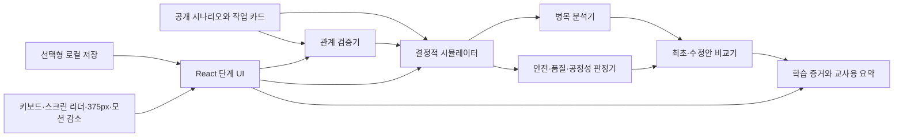

# Workflow Bottleneck Center Implementation Plan

> **For agentic workers:** REQUIRED SUB-SKILL: Use superpowers:subagent-driven-development (recommended) or superpowers:executing-plans to implement this plan task-by-task. Steps use checkbox (`- [ ]`) syntax for tracking.

**Goal:** 초등 5~6학년 학생이 공개된 선행 관계·병렬 가능 여부·제한 자원을 이용해 네 가지 가상 과제의 일정을 만들고, 결정적 시뮬레이션에서 기다림과 병목을 찾아 안전·품질·역할 공정성을 지키는 수정안을 설명할 수 있는 정적 학습 SPA를 구현합니다.

**Architecture:** 시나리오 카탈로그와 순수 TypeScript 도메인 엔진을 React UI에서 분리합니다. 관계 검증기, 결정적 일정 시뮬레이터, 병목 분석기, 성공 판정기, 최초·수정안 비교기를 순수 함수로 만들고, React reducer가 `의뢰 접수 → 관계 설계 → 일정 배치 → 가상 실행 → 병목 분석 → 수정 → 보고서` 학습 상태만 조정합니다. 저장은 기본 비활성인 버전형 로컬 저장 어댑터를 통하며 서버·로그인·외부 AI·실제 일정 API를 사용하지 않습니다.

**Tech Stack:** Vite, React 19, TypeScript 5, Vitest, React Testing Library, `@testing-library/user-event`, `vitest-axe`, Playwright, ESLint, CSS Modules가 아닌 분리된 전역 CSS 토큰·레이아웃 파일, 브라우저 `localStorage` 선택 저장

**Spec:** `/Volumes/ External Drive 256G/Dev2/codex/workflow-bottleneck-center/2026-08-26-workflow-bottleneck-center-design.md`

## Global Constraints

- 대상은 초등 5~6학년, 교과는 실과·정보, 한 차시 권장 시간은 30~40분입니다.
- 모든 결과는 교육용 가상 시간 단위이며 실제 작업 시간이나 사람의 생산성을 측정·예측하지 않는다고 의뢰 접수, 실행, 보고서에 반복 표기합니다.
- 네 시나리오는 각각 5~7개 작업, 선행 관계, 병렬 작업, 제한 자원 1~2개를 포함하며 모든 판정 조건을 작업 전에 공개합니다.
- 가장 빠른 시간 하나만 정답으로 인정하지 않습니다. 동률이거나 서로 다른 절충을 가진 여러 일정도 안전·품질·역할 공정성 기준을 충족하면 성공입니다.
- 안전 또는 품질 필수 단계를 생략한 빠른 일정은 성공이 아니며, 정확한 누락 단계와 `완료 조건이 충족되지 않았습니다` 피드백을 제공합니다.
- 병목은 가장 긴 작업 자체가 아니라 이후 작업의 실제 시작을 늦춘 선행 경로 또는 제한 자원·역할 대기로 계산합니다.
- 휴식·확인·협력을 낭비로 부르지 않고, 역할 능력을 성별·성격·신체 특성과 연결하지 않으며, 위험 장비나 아동 노동을 연상시키는 내용을 사용하지 않습니다.
- 서버, 로그인, 외부 AI, 실제 일정 서비스, 온라인 협업, 성과 순위, 학생 이름 입력을 구현하지 않습니다. 화면과 내보내기에는 역할 A·B·C만 사용합니다.
- 로컬 진행 저장은 기본값 `false`인 명시적 선택 기능이며, 선택하지 않으면 새로고침 뒤 진행을 복원하지 않습니다. 저장 데이터는 버전형 학습 상태뿐이고 개인 식별 정보는 받지 않습니다.
- 동일한 `ScenarioDefinition`, `ScheduleDraft`, `DependencyEdge[]` 입력은 배열 입력 순서와 무관하게 항상 깊은 동등성을 갖는 `SimulationResult`를 반환합니다.
- 관계 연결선은 색상만 사용하지 않고 선 모양, 화살표, 텍스트 라벨을 함께 사용합니다. 시간축과 동일 정보를 제공하는 단계 목록 보기를 제공합니다.
- 현재 화면의 필수 행동 버튼 하나에만 `gi-pulse`를 적용합니다. `prefers-reduced-motion: reduce`에서는 깜빡임과 자동 진행을 없애고 정적 윤곽선과 수동 단계 이동으로 대체합니다.
- 모든 작업·시점·담당 선택과 전 미션 완료가 드래그 없이 키보드만으로 가능해야 하며, 상태 변화는 `aria-live`로 공지합니다.
- 375px 너비에서는 관계도 또는 일정표 한 화면과 별도 요약 패널을 보여 주고 가로 스크롤 없이 완료할 수 있어야 합니다.
- 화면 오른쪽 아래에 작은 `업데이트 내역` 버튼을 고정하고 `2026-08-26` 설계 기록과 `2026-08-26` MVP 개발·검수 기록을 표시합니다. 이 계획 이후 기능 변경은 변경일과 한 줄 내역을 같은 데이터 파일에 추가합니다.
- `src`, `e2e`, `scripts`의 `.ts`, `.tsx`, `.css`, `.mjs` 파일은 각각 최대 499줄입니다. 500줄에 도달하기 전에 책임별로 분리하며 `npm run check:file-length`가 초과 파일을 실패 처리합니다.
- 이 문서의 셸 명령은 구현 시 실행할 지시문입니다. 계획 작성 중에는 패키지 설치, Git 초기화, 커밋, 푸시, 배포를 실행하지 않습니다.

---

## Pre-Task File Structure Map

The file boundaries are locked before task execution: `src/data/scenarios/*` owns only published mission facts; `src/domain/*` owns deterministic pure functions and shared contracts; `src/app/*` owns learning state transitions; `src/storage/*` owns opt-in persistence and schema validation; `src/features/<stage>/*` owns one learning-stage UI; `src/components/*` owns cross-stage accessible primitives; `src/a11y/*` owns motion and focus helpers; `src/styles/*` owns tokens, layout, components, and motion in separate files; `tests/*` mirrors the unit/integration responsibility; `e2e/*` owns full learner paths; `scripts/check-file-length.mjs` enforces 499 lines. No domain file imports React, browser storage, timers, or scenario UI components. The expanded exact tree and per-file responsibilities appear in **Expected File Structure and Responsibilities** and remain normative for every task.

## Implementation Tasks

### Task 1: Reproducible SPA and Test Harness

**Files:**
- Create: `.gitignore`
- Create: `package.json`
- Generate during execution: `package-lock.json`
- Create: `index.html`
- Create: `vite.config.ts`
- Create: `tsconfig.json`
- Create: `tsconfig.app.json`
- Create: `tsconfig.node.json`
- Create: `eslint.config.js`
- Create: `playwright.config.ts`
- Create: `src/vite-env.d.ts`
- Create: `src/main.tsx`
- Create: `src/App.tsx`
- Create: `src/test/setup.ts`
- Create: `tests/ui/app-smoke.test.tsx`
- Create: `tests/architecture/fileLength.test.ts`
- Create: `scripts/check-file-length.mjs`

**Interfaces:**
- Consumes: the project root containing the design and implementation-plan documents.
- Produces: `npm run dev`, `npm run test`, `npm run test:e2e`, `npm run lint`, `npm run build`, `npm run check:file-length`, and `npm run verify`; `App(): JSX.Element`; a Vitest `jsdom` environment with `@testing-library/jest-dom/vitest` and `vitest-axe/extend-expect` loaded.

- [ ] **Step 1: Initialize the future repository and install the declared toolchain**

Run only when implementation is authorized:

```bash
git init -b main
npm init -y
npm install --save-exact react@19 react-dom@19
npm install --save-dev --save-exact typescript@5 vite@7 @vitejs/plugin-react @types/react@19 @types/react-dom@19 @types/node eslint @eslint/js typescript-eslint eslint-plugin-react-hooks eslint-plugin-react-refresh vitest jsdom @testing-library/react @testing-library/jest-dom @testing-library/user-event vitest-axe axe-core @playwright/test
```

Expected: `.git/`, `node_modules/`, and `package-lock.json` are created; `npm ls react react-dom vite vitest @playwright/test` exits 0. Do not use `npm create vite`, because the two planning documents in the non-empty root must not be overwritten.

- [ ] **Step 2: Define exact package scripts and compiler/test configuration**

Set `package.json` to `"private": true`, `"type": "module"`, `"engines": { "node": ">=22.12" }`, and these scripts:

```json
{
  "scripts": {
    "dev": "vite",
    "preview": "vite preview",
    "test": "vitest run",
    "test:watch": "vitest",
    "test:e2e": "npm run build && playwright test",
    "lint": "eslint . --max-warnings=0",
    "typecheck": "tsc -b --pretty false",
    "build": "tsc -b && vite build",
    "check:file-length": "node scripts/check-file-length.mjs",
    "verify": "npm run lint && npm run typecheck && npm run test && npm run check:file-length && npm run build"
  }
}
```

Configure `tsconfig.app.json` with `target: "ES2022"`, libs `ES2022`, `DOM`, `DOM.Iterable`, `module: "ESNext"`, `moduleResolution: "Bundler"`, `jsx: "react-jsx"`, `strict: true`, `noEmit: true`, `noUncheckedIndexedAccess: true`, `exactOptionalPropertyTypes: true`, and types `vite/client`, `vitest/globals`, `@testing-library/jest-dom`; include `src` and `tests`. Configure `tsconfig.node.json` with the same strictness, `types: ["node"]`, and includes `vite.config.ts`, `playwright.config.ts`, `scripts`, and `e2e`. The root `tsconfig.json` references both files. Configure Vitest in `vite.config.ts` with `environment: "jsdom"`, `setupFiles: ["./src/test/setup.ts"]`, and test inclusion `tests/**/*.test.{ts,tsx}`. Configure Playwright with Chromium, `baseURL: "http://127.0.0.1:4173"`, `webServer.command: "npm run preview -- --host 127.0.0.1 --port 4173"`, and `reuseExistingServer: false`. ESLint ignores `dist`, `coverage`, `playwright-report`, and `test-results`, extends `@eslint/js` and `typescript-eslint` recommended rules, enables React Hooks rules, and permits React Refresh constant exports.

`.gitignore` contains exactly these project artifacts, one per line: `node_modules/`, `dist/`, `coverage/`, `playwright-report/`, `test-results/`, `.DS_Store`, `*.local`. It does not ignore the design, plan, source, lockfile, QA record, or E2E fixtures.

- [ ] **Step 3: Write the failing shell and React smoke tests**

`tests/ui/app-smoke.test.tsx`:

```tsx
import { render, screen } from "@testing-library/react";
import { App } from "../../src/App";

it("shows the Korean service name and virtual-time boundary", () => {
  render(<App />);
  expect(screen.getByRole("heading", { name: "작업 순서 병목 해결소" })).toBeVisible();
  expect(screen.getByText(/교육용 가상 시간/)).toBeVisible();
});
```

`scripts/check-file-length.mjs` must accept optional root-directory arguments; with none, it scans `src`, `tests`, `e2e`, and `scripts`. It scans `.ts`, `.tsx`, `.css`, `.mjs`, ignores `node_modules`, `dist`, and `playwright-report`, and exits 1 with `<path>: <count> lines exceeds 499` for any count greater than 499. `tests/architecture/fileLength.test.ts` creates 499-line and 500-line files under `mkdtempSync(join(tmpdir(), "workflow-file-length-"))`, invokes the script through `spawnSync(process.execPath, [scriptPath, tempRoot])`, expects exit codes 0 and 1 respectively, checks the exact 500-line diagnostic, and removes only that generated temporary directory in `afterEach`.

- [ ] **Step 4: Run the tests to verify they fail for the intended reasons**

Run:

```bash
npm run test -- tests/ui/app-smoke.test.tsx tests/architecture/fileLength.test.ts
npm run check:file-length
```

Expected: the React test fails because `src/App.tsx` does not export `App`; the length command fails until `scripts/check-file-length.mjs` exists. Dependency-resolution or configuration errors do not count as the intended red state and must be fixed before continuing.

- [ ] **Step 5: Write the minimal application shell and length checker**

`src/App.tsx` minimal implementation:

```tsx
export function App() {
  return (
    <main>
      <h1>작업 순서 병목 해결소</h1>
      <p>모든 시간은 교육용 가상 시간 단위이며 실제 작업 시간을 예측하지 않습니다.</p>
    </main>
  );
}
```

`src/main.tsx` renders `<App />` into `#root`. `index.html` uses `<html lang="ko">` and title `작업 순서 병목 해결소`. The length checker must sort paths before reporting so its output is deterministic.

- [ ] **Step 6: Run the focused and baseline quality gates**

Run:

```bash
npm run test -- tests/ui/app-smoke.test.tsx tests/architecture/fileLength.test.ts
npm run check:file-length
npm run typecheck
npm run build
```

Expected: one smoke test passes, all inspected files are at most 499 lines, TypeScript reports zero errors, and Vite creates `dist/index.html` with exit code 0.

- [ ] **Step 7: Commit the independently testable scaffold**

```bash
git add .gitignore package.json package-lock.json index.html vite.config.ts tsconfig.json tsconfig.app.json tsconfig.node.json eslint.config.js playwright.config.ts scripts/check-file-length.mjs src/main.tsx src/App.tsx src/vite-env.d.ts src/test/setup.ts tests/ui/app-smoke.test.tsx tests/architecture/fileLength.test.ts 2026-08-26-workflow-bottleneck-center-design.md 2026-08-26-workflow-bottleneck-center-implementation-plan.md
git commit -m "chore: scaffold workflow bottleneck center"
```

Expected: one commit is created and `git status --short` is empty; both planning documents are preserved and tracked.

### Task 2: Typed Scenario Catalog with Fully Public Constraints

**Files:**
- Create: `src/domain/types.ts`
- Create: `src/domain/scenarioValidation.ts`
- Create: `src/data/scenarios/scienceDisplay.ts`
- Create: `src/data/scenarios/libraryCart.ts`
- Create: `src/data/scenarios/classPresentation.ts`
- Create: `src/data/scenarios/ecoCampaignBooth.ts`
- Create: `src/data/scenarios/index.ts`
- Create: `src/test/fixtures.ts`
- Create: `tests/domain/scenarios.test.ts`

**Interfaces:**
- Consumes: the exact `ScenarioDefinition` family in **Domain Contract** and every row in **Exact Scenario Content**.
- Produces: `scenarioCatalog: readonly ScenarioDefinition[]`; `getScenario(id: ScenarioId): ScenarioDefinition`; `assertScenarioDefinition(scenario: ScenarioDefinition): void`; `requiredEdgesFromScenario(scenario: ScenarioDefinition): readonly DependencyEdge[]`; `makeScenario(overrides?: Partial<ScenarioDefinition>): ScenarioDefinition` for tests only.

- [ ] **Step 1: Write failing catalog integrity and learning-safety tests**

`tests/domain/scenarios.test.ts` must contain these assertions:

```ts
it("contains exactly four missions with five to seven tasks", () => {
  expect(scenarioCatalog.map(({ id }) => id)).toEqual([
    "science-display",
    "library-cart",
    "class-presentation",
    "eco-campaign-booth",
  ]);
  expect(scenarioCatalog.every((scenario) => scenario.tasks.length >= 5 && scenario.tasks.length <= 7)).toBe(true);
});

it("publishes every prerequisite, resource, condition, and unlock reference", () => {
  for (const scenario of scenarioCatalog) {
    expect(() => assertScenarioDefinition(scenario)).not.toThrow();
    for (const task of scenario.tasks) {
      expect(task.duration).toBeGreaterThan(0);
      expect(task.conditions.every((condition) => condition.label.trim().length > 0)).toBe(true);
      expect(task.prerequisites.every((item) => item.reason.trim().length > 0)).toBe(true);
    }
  }
});

it("uses only role labels and the virtual-time disclaimer", () => {
  const serialized = JSON.stringify(scenarioCatalog);
  expect(serialized).toContain("역할 A");
  expect(serialized).not.toMatch(/학생 이름|성별|생산성 점수|실제 작업 시간을 예측/);
  expect(scenarioCatalog.every(({ disclaimer }) => disclaimer === "모든 시간은 교육용 가상 단위이며 실제 작업 수행 시간을 예측하지 않습니다.")).toBe(true);
});
```

Add exact-count tests: mission task counts are `6, 7, 6, 7`; resource capacities are respectively `[1]`, `[1]`, `[1, 1]`, `[1, 1]`; every `unlocks` array is the reverse index of all `prerequisites`.

- [ ] **Step 2: Run the catalog tests and verify the red state**

Run: `npm run test -- tests/domain/scenarios.test.ts`

Expected: FAIL with module-not-found errors for `src/data/scenarios/index.ts` and `src/domain/scenarioValidation.ts`; there must be no false green from an empty test include pattern.

- [ ] **Step 3: Implement the shared types and strict scenario validator**

Copy the contracts from **Domain Contract** without renaming properties. `assertScenarioDefinition` must throw descriptive errors for duplicate task IDs, non-positive or non-integer duration, unknown prerequisite task, unknown resource, quantity above capacity, unknown unlock target, mismatched reverse unlock, empty reason/condition, self-dependency, and task counts outside 5–7.

Core validation shape:

```ts
export function assertScenarioDefinition(scenario: ScenarioDefinition): void {
  const taskIds = new Set(scenario.tasks.map(({ id }) => id));
  if (taskIds.size !== scenario.tasks.length) throw new Error(`${scenario.id}: duplicate task id`);
  if (scenario.tasks.length < 5 || scenario.tasks.length > 7) throw new Error(`${scenario.id}: task count must be 5..7`);
  const resourceCapacity = new Map(scenario.resources.map(({ id, capacity }) => [id, capacity]));
  const expectedUnlocks = new Map(scenario.tasks.map(({ id }) => [id, [] as string[]]));
  for (const task of scenario.tasks) {
    if (!Number.isInteger(task.duration) || task.duration <= 0) throw new Error(`${task.id}: duration must be a positive integer`);
    if (!task.id.trim() || !task.title.trim()) throw new Error(`${scenario.id}: empty task id or title`);
    for (const dependency of task.prerequisites) {
      if (!taskIds.has(dependency.taskId)) throw new Error(`${task.id}: unknown prerequisite ${dependency.taskId}`);
      if (dependency.taskId === task.id) throw new Error(`${task.id}: self dependency`);
      if (!dependency.reason.trim()) throw new Error(`${task.id}: empty prerequisite reason`);
      expectedUnlocks.get(dependency.taskId)?.push(task.id);
    }
    for (const requirement of task.resources) {
      const capacity = resourceCapacity.get(requirement.resourceId);
      if (capacity === undefined) throw new Error(`${task.id}: unknown resource ${requirement.resourceId}`);
      if (requirement.quantity > capacity) throw new Error(`${task.id}: resource quantity exceeds capacity`);
    }
    for (const condition of task.conditions) {
      if (!condition.id.trim() || !condition.label.trim()) throw new Error(`${task.id}: empty condition`);
    }
  }
  for (const task of scenario.tasks) {
    const actual = [...task.unlocks].sort();
    const expected = [...(expectedUnlocks.get(task.id) ?? [])].sort();
    if (actual.some((id) => !taskIds.has(id))) throw new Error(`${task.id}: unknown unlock target`);
    if (JSON.stringify(actual) !== JSON.stringify(expected)) throw new Error(`${task.id}: unlock reverse index mismatch`);
  }
}
```

The test file must trigger and assert every exact error suffix shown in this implementation, including duplicate IDs, task count, duration, empty ID/title, unknown/self prerequisite, empty reason, unknown/over-capacity resource, empty condition, unknown unlock, and reverse-index mismatch.

- [ ] **Step 4: Implement all four scenario files from the exact content tables**

Each scenario file exports one frozen `ScenarioDefinition`. Use the IDs, title, duration, prerequisite kind, people count, resource, parallel mode, condition copy, time goal, and fairness values from **Exact Scenario Content**. Resolve the final mission's two-category requirement as two explicit dependencies: `check-safe-path → final-safety-walkthrough` has kind `safety`; `set-up-booth → final-safety-walkthrough` has kind `quality`. Give each condition a stable ID `<task-id>:safety` or `<task-id>:quality`.

`src/data/scenarios/index.ts`:

```ts
export const scenarioCatalog = Object.freeze([
  scienceDisplay,
  libraryCart,
  classPresentation,
  ecoCampaignBooth,
]);

export function getScenario(id: ScenarioId): ScenarioDefinition {
  const scenario = scenarioCatalog.find((item) => item.id === id);
  if (!scenario) throw new Error(`Unknown scenario: ${id}`);
  return scenario;
}
```

Call `assertScenarioDefinition` for each catalog item in development and tests. Do not add dynamic content, network loading, names, scores, or real-world duration claims.

- [ ] **Step 5: Run tests, type checks, and the file-length gate**

Run:

```bash
npm run test -- tests/domain/scenarios.test.ts
npm run typecheck
npm run check:file-length
```

Expected: all scenario tests pass; the catalog order and counts are exact; every reference is valid; no file exceeds 499 lines.

- [ ] **Step 6: Commit the public scenario contract**

```bash
git add src/domain/types.ts src/domain/scenarioValidation.ts src/data/scenarios src/test/fixtures.ts tests/domain/scenarios.test.ts
git commit -m "feat: define transparent classroom missions"
```

Expected: a single task-scoped commit; no generated build output is staged.

### Task 3: Relationship Validation without Hidden Rules

**Files:**
- Create: `src/domain/relationValidator.ts`
- Create: `tests/domain/relationValidator.test.ts`

**Interfaces:**
- Consumes: `ScenarioDefinition`, `DependencyEdge`, and `requiredEdgesFromScenario(scenario)` from Task 2.
- Produces: `edgeKey(edge: DependencyEdge): string`; `validateRelationMap(scenario: ScenarioDefinition, edges: readonly DependencyEdge[]): RelationValidation`.

- [ ] **Step 1: Write failing tests for complete, missing, extra, duplicate, and cyclic relation maps**

```ts
const required = requiredEdgesFromScenario(getScenario("science-display"));

it("accepts the fully published required map", () => {
  expect(validateRelationMap(getScenario("science-display"), required)).toEqual({
    status: "valid",
    missingRequired: [],
    unnecessary: [],
    duplicate: [],
    unknown: [],
    cycleTaskIds: [],
  });
});

it("names a missing public edge instead of hiding the rule", () => {
  const withoutPrintBeforeAttach = required.filter(
    (edge) => !(edge.beforeTaskId === "print-text" && edge.afterTaskId === "attach-materials"),
  );
  const result = validateRelationMap(getScenario("science-display"), withoutPrintBeforeAttach);
  expect(result.status).toBe("invalid");
  expect(result.missingRequired).toContainEqual({ beforeTaskId: "print-text", afterTaskId: "attach-materials" });
});

it("allows an unnecessary safe edge but marks lost parallelism", () => {
  const extra = { beforeTaskId: "prepare-print-file", afterTaskId: "prepare-illustrations" };
  const result = validateRelationMap(getScenario("science-display"), [...required, extra]);
  expect(result.status).toBe("valid-with-extra");
  expect(result.unnecessary).toEqual([extra]);
});
```

Also assert that a repeated edge is listed once in `duplicate` and makes status `invalid`; `{ beforeTaskId: "missing", afterTaskId: "verify-content" }` appears unchanged in `unknown` and makes status `invalid`; and `prepare-print-file → prepare-illustrations → prepare-print-file` returns those two IDs in stable scenario order in `cycleTaskIds`.

- [ ] **Step 2: Run the focused test and confirm the missing implementation failure**

Run: `npm run test -- tests/domain/relationValidator.test.ts`

Expected: FAIL because `validateRelationMap` is not exported. A cycle test timing out is not acceptable; cycle detection must be bounded by the number of tasks and edges.

- [ ] **Step 3: Implement canonical edge normalization and bounded cycle detection**

Use this exact key contract:

```ts
export const edgeKey = ({ beforeTaskId, afterTaskId }: DependencyEdge) =>
  `${beforeTaskId}->${afterTaskId}`;
```

Normalize output arrays by the scenario task index of `beforeTaskId`, then `afterTaskId`, then lexical key. Detect cycles with Kahn's algorithm over known task IDs; unknown/self edges are structural invalidity and must not enter the graph. Derive status as:

```ts
const status = hasUnknown || duplicate.length || cycleTaskIds.length || missingRequired.length
  ? "invalid"
  : unnecessary.length
    ? "valid-with-extra"
    : "valid";
```

Return fresh frozen arrays so callers cannot mutate scenario-derived state.

- [ ] **Step 4: Run the focused and catalog regression tests**

Run:

```bash
npm run test -- tests/domain/relationValidator.test.ts tests/domain/scenarios.test.ts
npm run typecheck
```

Expected: all relation cases pass, cycle output is stable, and scenario validation remains green.

- [ ] **Step 5: Commit relationship validation**

```bash
git add src/domain/relationValidator.ts tests/domain/relationValidator.test.ts
git commit -m "feat: validate visible task relationships"
```

Expected: the commit contains only the relation validator and its test.

### Task 4: Deterministic Virtual-Time Simulator

**Files:**
- Create: `src/domain/waitIntervals.ts`
- Create: `src/domain/simulator.ts`
- Create: `tests/domain/simulator.test.ts`
- Modify: `src/test/fixtures.ts`

**Interfaces:**
- Consumes: `ScenarioDefinition`, `ScheduleDraft`, `TaskRun`, `WaitInterval`, `SimulationResult`, and `validateRelationMap`.
- Produces: `mergeWaitIntervals(intervals: readonly WaitInterval[]): readonly WaitInterval[]`; `simulateSchedule(scenario: ScenarioDefinition, draft: ScheduleDraft): SimulationResult`.

- [ ] **Step 1: Write failing tests for dependency, resource, role, solo, omission, and determinism**

Use `makeScenario` to create two-task classroom-safe fixtures. The resource fixture has tasks `left` then `right`, each duration 2, roles A/B, no dependencies, both using resource `shared-card-set` capacity 1.

```ts
it("delays a task until its published prerequisite ends", () => {
  const scenario = getScenario("science-display");
  const result = simulateSchedule(scenario, {
    learnerEdges: requiredEdgesFromScenario(scenario),
    entries: [
      { taskId: "verify-content", plannedStart: 0, roleIds: ["A"] },
      { taskId: "prepare-print-file", plannedStart: 0, roleIds: ["B"] },
    ],
  });
  expect(result.runs.find(({ taskId }) => taskId === "prepare-print-file")).toMatchObject({ actualStart: 2, end: 4 });
  expect(result.waits).toContainEqual(expect.objectContaining({ taskId: "prepare-print-file", from: 0, to: 2, reason: "dependency", blockerTaskId: "verify-content" }));
});

it("uses scenario order to settle a one-capacity resource tie", () => {
  const result = simulateSchedule(resourceFixture, {
    learnerEdges: [],
    entries: [
      { taskId: "right", plannedStart: 0, roleIds: ["B"] },
      { taskId: "left", plannedStart: 0, roleIds: ["A"] },
    ],
  });
  expect(result.runs).toEqual([
    { taskId: "left", plannedStart: 0, actualStart: 0, end: 2, roleIds: ["A"] },
    { taskId: "right", plannedStart: 0, actualStart: 2, end: 4, roleIds: ["B"] },
  ]);
  expect(result.waits).toContainEqual(expect.objectContaining({ taskId: "right", from: 0, to: 2, reason: "resource", resourceId: "shared-card-set" }));
});

it("is deeply equal when entry and edge input arrays are reversed", () => {
  const forward = simulateSchedule(resourceFixture, resourceDraft);
  const reversed = simulateSchedule(resourceFixture, { entries: [...resourceDraft.entries].reverse(), learnerEdges: [...resourceDraft.learnerEdges].reverse() });
  expect(reversed).toEqual(forward);
});
```

Add cases where the same role cannot perform overlapping tasks, a `solo` task waits for all active tasks to end, an omitted prerequisite puts the dependent entry in `blockedTaskIds`, missing scheduled tasks appear in scenario order in `omittedTaskIds`, invalid role counts yield an issue without running that entry, and consecutive unit waits coalesce into one interval.

- [ ] **Step 2: Run the simulator test and verify it fails at the missing export**

Run: `npm run test -- tests/domain/simulator.test.ts`

Expected: FAIL because `simulateSchedule` and `mergeWaitIntervals` are absent. The failure must occur before any assertion is weakened.

- [ ] **Step 3: Implement a bounded discrete-time engine**

Algorithm contract:

```ts
const taskOrder = new Map(scenario.tasks.map((task, index) => [task.id, index]));
const entries = normalizeAndValidateEntries(draft.entries, taskOrder);
const dependencies = unionRequiredAndLearnerEdges(scenario, draft.learnerEdges);
const upperBound = Math.max(0, ...entries.map((entry) => entry.plannedStart))
  + scenario.tasks.reduce((sum, task) => sum + task.duration, 0)
  + 1;
```

For each integer `time < upperBound`, finish active tasks first, then inspect pending tasks sorted by scenario order. Start every eligible non-conflicting parallel task; if a task cannot start, record one unit of waiting with the priority `dependency`, `resource`, `role`, `solo`. A `solo` task starts only when no other task is active, and no parallel task may start while a solo task is active. Stop early when all runnable entries finish. When no active task and no pending entry can ever become eligible because a predecessor is omitted or cyclic, populate `blockedTaskIds` and stop. Do not use `Date`, random numbers, animation clocks, browser APIs, or array insertion order.

- [ ] **Step 4: Implement deterministic wait coalescing**

`mergeWaitIntervals` joins only adjacent intervals whose `taskId`, `reason`, `blockerTaskId`, `resourceId`, and `roleId` all match and where previous `to === next.from`. Sort by `taskId` scenario order and `from` before return. A resource wait names the task currently occupying the capacity; a role wait names the occupied role; a dependency wait names the unfinished predecessor.

- [ ] **Step 5: Run simulator regressions and static gates**

Run:

```bash
npm run test -- tests/domain/simulator.test.ts tests/domain/relationValidator.test.ts tests/domain/scenarios.test.ts
npm run typecheck
npm run check:file-length
```

Expected: deterministic deep equality passes, no discrete loop exceeds its upper bound, all prior tests remain green, and both simulator files remain below 499 lines.

- [ ] **Step 6: Commit the deterministic engine**

```bash
git add src/domain/simulator.ts src/domain/waitIntervals.ts src/test/fixtures.ts tests/domain/simulator.test.ts
git commit -m "feat: simulate deterministic classroom schedules"
```

Expected: one commit with no UI or storage changes.

### Task 5: Bottleneck Analysis, Responsible Evaluation, and Revision Comparison

**Files:**
- Create: `src/domain/bottleneckAnalyzer.ts`
- Create: `src/domain/evaluator.ts`
- Create: `src/domain/comparison.ts`
- Create: `tests/domain/bottleneckAnalyzer.test.ts`
- Create: `tests/domain/evaluator.test.ts`
- Create: `tests/domain/comparison.test.ts`

**Interfaces:**
- Consumes: `ScenarioDefinition`, `ScheduleDraft`, `SimulationResult`, `WaitInterval`, and the output of `simulateSchedule`.
- Produces: `analyzeBottlenecks(scenario: ScenarioDefinition, result: SimulationResult): BottleneckAnalysis`; `evaluateSchedule(scenario: ScenarioDefinition, result: SimulationResult): ScheduleEvaluation`; `compareAttempts(scenario: ScenarioDefinition, initialDraft: ScheduleDraft, initial: ScheduleEvaluation, revisedDraft: ScheduleDraft, revised: ScheduleEvaluation): AttemptComparison`.

- [ ] **Step 1: Write a failing test proving that longest does not mean bottleneck**

Create a fixture with `long-independent` duration 6 finishing at time 6, and a dependency/resource chain `prepare` duration 2 → `shared-a` duration 3 → `finish` duration 3 finishing at time 8 with a two-unit resource wait before `shared-a`. Assert:

```ts
const analysis = analyzeBottlenecks(scenario, result);
expect(analysis.criticalTaskIds).toEqual(["prepare", "shared-a", "finish"]);
expect(analysis.findings.some(({ blockedTaskId }) => blockedTaskId === "long-independent")).toBe(false);
expect(analysis.findings).toContainEqual(expect.objectContaining({
  type: "resource-wait",
  blockedTaskId: "shared-a",
  delayUnits: 2,
}));
```

- [ ] **Step 2: Write failing tests for safety, quality, fairness, time, and multiple valid answers**

Required assertions:

```ts
it("never succeeds when a fast draft omits final quality review", () => {
  const evaluation = evaluateSchedule(scienceDisplay, resultWithoutFinalReview);
  expect(evaluation.status).toBe("incomplete");
  expect(evaluation.metrics.qualityMet).toBe(false);
  expect(evaluation.feedback).toContain("완료 조건이 충족되지 않았습니다: 최종 점검 작업이 빠졌습니다.");
});

it("accepts two safe schedules with different role tradeoffs", () => {
  expect(evaluateSchedule(scienceDisplay, simulateSchedule(scienceDisplay, validDraftA)).status).toBe("successful");
  expect(evaluateSchedule(scienceDisplay, simulateSchedule(scienceDisplay, validDraftB)).status).toBe("successful");
  expect(validDraftA).not.toEqual(validDraftB);
});
```

Add one exact case per violation kind: safety-required task omitted, role participation below the scenario minimum, max role-load gap exceeded by one unit, and finish time one unit above `timeGoal`. Confirm time improvement alone cannot change an unsafe result to `successful`.

- [ ] **Step 3: Write a failing comparison test**

```ts
const comparison = compareAttempts(scienceDisplay, initialDraft, initialEvaluation, revisedDraft, revisedEvaluation);
expect(comparison).toMatchObject({
  finishDelta: -2,
  waitDelta: -3,
  preserved: { safety: true, quality: true, fairness: true },
});
expect(comparison.changedTaskIds).toEqual(["prepare-illustrations", "print-text"]);
expect(comparison.summary).toContain("대기 3단위 감소");
```

- [ ] **Step 4: Run all three focused test files and verify the red state**

Run:

```bash
npm run test -- tests/domain/bottleneckAnalyzer.test.ts tests/domain/evaluator.test.ts tests/domain/comparison.test.ts
```

Expected: FAIL on missing domain exports. Test fixture arithmetic must be corrected if expected run times do not match the simulator; production expectations must not be loosened.

- [ ] **Step 5: Implement blocker-chain analysis**

For every run, find the wait interval ending at its `actualStart` whose blocker release equals that start. Begin at the run with greatest `end`, breaking ties by scenario order, and follow `blockerTaskId` backward. Emit findings only for positive-duration waits on this chain. Group identical resource/role/solo causes while preserving the blocked task order. Compute `affectedTaskIds` as downstream critical-chain tasks reachable from `blockedTaskId`. Use copy such as `프린터 사용을 기다려 글 인쇄가 2단위 늦어졌고 이후 부착과 점검이 함께 늦어졌습니다.`

- [ ] **Step 6: Implement multi-factor evaluation**

Compute:

```ts
const safetyMet = requiredSafetyTaskIds.every((id) => completedTaskIds.has(id));
const qualityMet = requiredQualityTaskIds.every((id) => completedTaskIds.has(id));
const fairnessMet = participatingRoleCount >= scenario.fairness.minParticipatingRoles
  && maxRoleLoad - minRoleLoad <= scenario.fairness.maxLoadGap;
const timeGoalMet = result.finishTime <= scenario.timeGoal;
```

`status` is `incomplete` for omitted, blocked, or structural issues; `revise` for a complete schedule missing safety, quality, fairness, or time criteria; `successful` only when all metrics are true. Feedback order is structure, safety, quality, fairness, time. Never use `빠른 팀`, `느린 역할`, `낭비`, rank, percentile, or productivity score.

- [ ] **Step 7: Implement stable initial-to-revision comparison**

Changed tasks are those whose `plannedStart` or sorted `roleIds` differ, returned in initial scenario order. Deltas are `revised - initial`, so a reduction is negative. The summary states both the quantitative change and condition preservation; if any preserved flag is false, it names that condition before mentioning time.

- [ ] **Step 8: Run domain tests and commit**

Run:

```bash
npm run test -- tests/domain
npm run typecheck
npm run check:file-length
```

Expected: every domain test passes; off-chain long work is not labeled a bottleneck; multiple successful drafts pass; omitted safety or quality never succeeds.

```bash
git add src/domain/bottleneckAnalyzer.ts src/domain/evaluator.ts src/domain/comparison.ts tests/domain/bottleneckAnalyzer.test.ts tests/domain/evaluator.test.ts tests/domain/comparison.test.ts
git commit -m "feat: evaluate responsible workflow improvements"
```

Expected: one domain-only commit with all prior tests green.

### Task 6: Learning-State Reducer and Opt-In Local Persistence

**Files:**
- Create: `src/app/appTypes.ts`
- Create: `src/app/appReducer.ts`
- Create: `src/app/appSelectors.ts`
- Create: `src/app/AppProvider.tsx`
- Create: `src/storage/progressRepository.ts`
- Create: `src/storage/localProgressRepository.ts`
- Create: `src/storage/progressCodec.ts`
- Create: `tests/app/appReducer.test.ts`
- Create: `tests/storage/progressRepository.test.ts`

**Interfaces:**
- Consumes: `ScenarioId`, `LearningStage`, `DependencyEdge`, `ScheduleDraft`, `SimulationResult`, `BottleneckAnalysis`, `ScheduleEvaluation`, `AttemptComparison`, and `WaitReason`.
- Produces: `LearningEvidence`, `AttemptSnapshot`, `MissionAttempt`, `AppState`, `AppAction`, `PersistedMissionAttempt`, `AppProgressV1`; `createInitialState(): AppState`; `appReducer(state: AppState, action: AppAction): AppState`; `canEnterStage(attempt: MissionAttempt, stage: LearningStage): boolean`; `getRequiredAction(attempt: MissionAttempt): "confirm-conditions" | "run-simulation" | "mark-bottleneck" | "compare-revision" | null`; `PersistenceResult = { ok: true } | { ok: false; message: string }`; `ProgressRepository`; `createMemoryProgressRepository()`; `createLocalProgressRepository(storage: Storage)`; `encodeProgress(state: AppState): AppProgressV1`; `decodeProgress(raw: string): AppProgressV1 | null`; `rehydrateProgress(progress: AppProgressV1): AppState`.

Use these exact state contracts:

```ts
export interface LearningEvidence {
  dependencyExplanation: string;
  parallelExplanation: string;
  bottleneckExplanation: string;
  tradeoffExplanation: string;
}

export interface AttemptSnapshot {
  draft: ScheduleDraft;
  result: SimulationResult;
  bottlenecks: BottleneckAnalysis;
  evaluation: ScheduleEvaluation;
}

export interface MissionAttempt {
  scenarioId: ScenarioId;
  stage: LearningStage;
  conditionsAcknowledged: boolean;
  relationEdges: readonly DependencyEdge[];
  draftSchedule: ScheduleDraft;
  initialSnapshot: AttemptSnapshot | null;
  prediction: WaitReason | null;
  predictionExplanation: string;
  selectedFindingId: string | null;
  revisedSchedule: ScheduleDraft | null;
  revisedSnapshot: AttemptSnapshot | null;
  comparison: AttemptComparison | null;
  evidence: LearningEvidence;
  completed: boolean;
}

export interface AppState {
  selectedScenarioId: ScenarioId;
  attempts: Readonly<Record<ScenarioId, MissionAttempt>>;
  saveEnabled: boolean;
  announcement: string;
  updateDialogOpen: boolean;
}

export type AppAction =
  | { type: "SELECT_SCENARIO"; scenarioId: ScenarioId }
  | { type: "ACKNOWLEDGE_CONDITIONS" }
  | { type: "SET_RELATIONS"; edges: readonly DependencyEdge[] }
  | { type: "SET_DRAFT_SCHEDULE"; draft: ScheduleDraft }
  | { type: "SAVE_INITIAL_SNAPSHOT"; snapshot: AttemptSnapshot }
  | { type: "SET_PREDICTION"; reason: WaitReason; explanation: string }
  | { type: "SELECT_BOTTLENECK"; findingId: string }
  | { type: "BEGIN_REVISION" }
  | { type: "SET_REVISED_SCHEDULE"; draft: ScheduleDraft }
  | { type: "SAVE_REVISED_SNAPSHOT"; snapshot: AttemptSnapshot; comparison: AttemptComparison }
  | { type: "SET_EVIDENCE_FIELD"; field: keyof LearningEvidence; value: string }
  | { type: "COMPLETE_MISSION" }
  | { type: "ENTER_STAGE"; stage: LearningStage }
  | { type: "SET_SAVE_ENABLED"; enabled: boolean }
  | { type: "OPEN_UPDATE_DIALOG" }
  | { type: "CLOSE_UPDATE_DIALOG" }
  | { type: "ANNOUNCE"; message: string };

export interface PersistedMissionAttempt {
  scenarioId: ScenarioId;
  stage: LearningStage;
  conditionsAcknowledged: boolean;
  relationEdges: readonly DependencyEdge[];
  draftSchedule: ScheduleDraft;
  prediction: WaitReason | null;
  predictionExplanation: string;
  selectedFindingId: string | null;
  revisedSchedule: ScheduleDraft | null;
  evidence: LearningEvidence;
  completed: boolean;
}

export interface AppProgressV1 {
  version: 1;
  selectedScenarioId: ScenarioId;
  saveEnabled: true;
  attempts: Readonly<Record<ScenarioId, PersistedMissionAttempt>>;
}
```

- [ ] **Step 1: Write failing reducer transition and guard tests**

```ts
it("starts every mission at briefing with storage disabled", () => {
  const state = createInitialState();
  expect(state.saveEnabled).toBe(false);
  expect(Object.values(state.attempts).every(({ stage }) => stage === "briefing")).toBe(true);
});

it("does not skip from briefing to simulation", () => {
  const state = createInitialState();
  const next = appReducer(state, { type: "ENTER_STAGE", stage: "simulation" });
  expect(next.attempts).toBe(state.attempts);
  expect(next.announcement).toContain("먼저 조건을 확인");
});

it("preserves the initial snapshot when revision begins", () => {
  const next = appReducer(stateWithInitialSnapshot, { type: "BEGIN_REVISION" });
  expect(next.attempts["science-display"].initialSnapshot).toBe(stateWithInitialSnapshot.attempts["science-display"].initialSnapshot);
  expect(next.attempts["science-display"].revisedSchedule).toEqual(stateWithInitialSnapshot.attempts["science-display"].draftSchedule);
});
```

Add guard cases: relation stage requires `conditionsAcknowledged`; schedule requires a relation map without missing required edges or cycles; analysis requires an initial snapshot and prediction; revision requires a selected bottleneck finding; report requires a revised snapshot and comparison. `completed` requires all four evidence strings after trimming and a revised evaluation with no safety or quality violation.

- [ ] **Step 2: Write failing persistence privacy tests**

```ts
it("does not write until saving is explicitly enabled", () => {
  const storage = mockStorage();
  const repository = createLocalProgressRepository(storage);
  repository.persist(createInitialState());
  expect(storage.setItem).not.toHaveBeenCalled();
});

it("stores only the versioned allowlist and role labels", () => {
  const encoded = encodeProgress(savedState);
  expect(encoded.version).toBe(1);
  expect(JSON.stringify(encoded)).not.toMatch(/studentName|learnerName|email|announcement|updateDialogOpen/);
});

it("ignores corrupt, wrong-version, and unknown-scenario payloads", () => {
  expect(decodeProgress("not-json")).toBeNull();
  expect(decodeProgress('{"version":2}')).toBeNull();
  expect(decodeProgress('{"version":1,"selectedScenarioId":"unknown"}')).toBeNull();
});
```

Also assert `clear()` removes only key `workflow-bottleneck-center:progress:v1`, and disabling save calls `clear()` once.

- [ ] **Step 3: Run both focused suites to establish the red state**

Run:

```bash
npm run test -- tests/app/appReducer.test.ts tests/storage/progressRepository.test.ts
```

Expected: FAIL because reducer and repository modules do not exist.

- [ ] **Step 4: Implement pure state transitions and selectors**

Use the discriminated `AppAction` union above without additional action names. Reject invalid transitions by preserving attempts and setting an exact explanatory announcement. Never mutate a prior attempt or snapshot.

`getRequiredAction` returns `confirm-conditions` at briefing, `run-simulation` at schedule, `mark-bottleneck` at analysis, `compare-revision` at revision, and `null` on other stages. It is the single source of truth for `gi-pulse`.

- [ ] **Step 5: Implement safe repositories and AppProvider**

```ts
export interface ProgressRepository {
  hydrate(): AppProgressV1 | null;
  persist(state: AppState): PersistenceResult;
  clear(): PersistenceResult;
}
```

`createMemoryProgressRepository` keeps the value only for the current page lifetime. `createLocalProgressRepository` writes only when `state.saveEnabled === true`, catches quota/security errors, and returns a nonfatal result that AppProvider turns into `이 기기에 저장하지 못했지만 현재 활동은 계속할 수 있습니다.`. `decodeProgress` rebuilds `PersistedMissionAttempt` from an allowlist, validates scenario/task/role IDs against the catalog, and never spreads unknown object properties. `rehydrateProgress` recomputes initial/revised snapshots and comparisons from saved drafts through the pure domain functions rather than trusting derived stored metrics.

- [ ] **Step 6: Run reducers, storage tests, type checks, and domain regressions**

Run:

```bash
npm run test -- tests/app tests/storage tests/domain
npm run typecheck
npm run check:file-length
```

Expected: all transitions and storage boundaries pass; default state produces zero local writes; malformed storage never crashes; all domain suites remain green.

- [ ] **Step 7: Commit state and privacy boundaries**

```bash
git add src/app src/storage tests/app tests/storage
git commit -m "feat: manage private local learning progress"
```

Expected: the commit contains no browser UI styling and no network integration.

### Task 7: App Shell, Briefing Cards, Required Action, and Update History

**Files:**
- Modify: `src/App.tsx`
- Create: `src/components/RequiredActionButton.tsx`
- Create: `src/components/LiveStatus.tsx`
- Create: `src/components/ModalDialog.tsx`
- Create: `src/components/UpdateHistoryButton.tsx`
- Create: `src/data/updateHistory.ts`
- Create: `src/features/briefing/BriefingScreen.tsx`
- Create: `src/features/briefing/TaskCard.tsx`
- Create: `tests/ui/briefing.test.tsx`
- Modify: `tests/ui/app-smoke.test.tsx`

**Interfaces:**
- Consumes: `AppProvider`, `AppState`, `ScenarioDefinition`, `TaskDefinition`, `getRequiredAction`, and the four-scenario catalog.
- Produces: `IsoDate = \`${number}-${number}-${number}\``; `RequiredActionButtonProps { actionId: NonNullable<ReturnType<typeof getRequiredAction>>; activeActionId: ReturnType<typeof getRequiredAction>; children: ReactNode; onClick(): void }`; `UpdateEntry { date: IsoDate; category: "설계" | "개발" | "개선"; description: string }`; `updateHistory: readonly UpdateEntry[]`; `BriefingScreen`; `TaskCard`; a stage shell with one `<main>` and one `<h1>`.

- [ ] **Step 1: Write failing tests for visible constraints and safe copy**

```tsx
it("shows every task-card judgment field before confirmation", async () => {
  renderAppAt("science-display", "briefing");
  const card = screen.getByRole("article", { name: "글과 그림 부착" });
  expect(within(card).getByText("예상 시간 2단위")).toBeVisible();
  expect(within(card).getByText(/먼저: 글 인쇄, 그림 배치 준비/)).toBeVisible();
  expect(within(card).getByText("필요한 사람 2명")).toBeVisible();
  expect(within(card).getByText("동시에 진행: 단독 진행")).toBeVisible();
  expect(within(card).getByText(/통로를 막지 않는 책상/)).toBeVisible();
  expect(within(card).getByText("끝난 뒤 열림: 최종 점검")).toBeVisible();
});

it("uses exactly one active pulse target", () => {
  renderAppAt("science-display", "briefing");
  expect(screen.getAllByTestId("required-action")).toHaveLength(1);
  expect(screen.getByRole("button", { name: "조건 확인" })).toHaveAttribute("data-pulse", "true");
});
```

Add assertions for the virtual-time disclaimer, no ranking/productivity wording, mission completion conditions, time goal labeled as a goal rather than the only answer, local-save switch default off, and task-card `aria-labelledby`.

- [ ] **Step 2: Write the failing update-history dialog test**

```tsx
it("opens dated update history and restores focus on close", async () => {
  const user = userEvent.setup();
  render(<App />);
  const trigger = screen.getByRole("button", { name: "업데이트 내역" });
  await user.click(trigger);
  const dialog = screen.getByRole("dialog", { name: "업데이트 내역" });
  expect(within(dialog).getAllByText("2026-08-26")).toHaveLength(2);
  expect(within(dialog).getByText("최초 설계 문서 작성")).toBeVisible();
  expect(within(dialog).getByText("MVP 구현과 네 시나리오 검수")).toBeVisible();
  await user.click(within(dialog).getByRole("button", { name: "닫기" }));
  expect(trigger).toHaveFocus();
});
```

- [ ] **Step 3: Run the focused UI tests and confirm the red state**

Run: `npm run test -- tests/ui/app-smoke.test.tsx tests/ui/briefing.test.tsx`

Expected: FAIL because briefing components and update history do not exist.

- [ ] **Step 4: Implement the exact update data and accessible primitives**

`src/data/updateHistory.ts`:

```ts
export const updateHistory = Object.freeze([
  { date: "2026-08-26", category: "설계", description: "최초 설계 문서 작성" },
  { date: "2026-08-26", category: "개발", description: "MVP 구현과 네 시나리오 검수" },
] as const);
```

`RequiredActionButton` sets `data-pulse="true"` and class `gi-pulse` only when its `actionId === activeActionId`. `ModalDialog` uses `role="dialog"`, `aria-modal="true"`, focuses its heading or close button on open, traps Tab within the dialog, closes on Escape, and restores trigger focus. `LiveStatus` renders a visually available polite region for routine state and assertive text only for blocked safety/quality feedback.

- [ ] **Step 5: Implement the briefing and task-card information hierarchy**

Before the cards, render the differentiation copy `이 활동은 명령을 한 줄씩 실행하거나 물건을 나누는 활동이 아니라, 여러 작업의 선후 관계·동시 진행·제한 자원에서 생긴 기다림을 살펴봅니다.` and the human-centered copy `협력이 필요하면 도움을 요청하고 역할을 바꿀 수 있습니다. 도움 요청·확인·휴식은 낭비가 아닙니다.` Each card renders these labeled groups in this order: title, duration, prerequisites with public reason, people/resources, parallel mode, safety/quality conditions, unlocks. Empty resources render `필요한 도구 없음`; empty prerequisites render `먼저 할 작업 없음`; empty unlocks render `이 작업이 마지막 단계입니다`. `조건 확인` dispatches `ACKNOWLEDGE_CONDITIONS` and enters relations. The shell exposes scenario navigation without losing each mission's separate attempt.

- [ ] **Step 6: Run focused UI, axe smoke, and regression tests**

Run:

```bash
npm run test -- tests/ui/app-smoke.test.tsx tests/ui/briefing.test.tsx
npm run test -- tests/domain tests/app tests/storage
npm run typecheck
```

Expected: task-card fields and update dates pass; focus returns after dialog close; exactly one briefing button is pulsed; no prior suite regresses.

- [ ] **Step 7: Commit the first learner screen**

```bash
git add src/App.tsx src/components src/data/updateHistory.ts src/features/briefing tests/ui/app-smoke.test.tsx tests/ui/briefing.test.tsx
git commit -m "feat: present transparent mission conditions"
```

Expected: one UI commit; no styles beyond semantic class hooks are required to pass this task.

### Task 8: Accessible Relationship Design Board

**Files:**
- Create: `src/features/relations/RelationScreen.tsx`
- Create: `src/features/relations/RelationBoard.tsx`
- Create: `src/features/relations/RelationEditor.tsx`
- Create: `tests/ui/relations.test.tsx`
- Modify: `src/App.tsx`

**Interfaces:**
- Consumes: `ScenarioDefinition`, `DependencyEdge[]`, `RelationValidation`, `validateRelationMap`, `SET_RELATIONS`, and `ENTER_STAGE`.
- Produces: `RelationEditorProps { scenario: ScenarioDefinition; edges: readonly DependencyEdge[]; onChange(edges: readonly DependencyEdge[]): void }`; `RelationBoardProps` with the same scenario/edges plus `validation`; screen-reader list entries in the form `<먼저 작업> 다음에 <다음 작업>: <공개 이유 또는 학생이 추가한 관계>`.

- [ ] **Step 1: Write the failing keyboard-only relation editor test**

```tsx
it("adds and removes a relation without dragging", async () => {
  const user = userEvent.setup();
  renderRelationScreen("science-display");
  await user.selectOptions(screen.getByLabelText("먼저 끝낼 작업"), "verify-content");
  await user.selectOptions(screen.getByLabelText("다음에 시작할 작업"), "prepare-print-file");
  await user.click(screen.getByRole("button", { name: "관계 연결" }));
  expect(screen.getByRole("listitem", { name: /자료 확인 다음에 인쇄 글 정리/ })).toBeVisible();
  await user.click(screen.getByRole("button", { name: "자료 확인과 인쇄 글 정리 관계 삭제" }));
  expect(screen.queryByRole("listitem", { name: /자료 확인 다음에 인쇄 글 정리/ })).not.toBeInTheDocument();
});
```

- [ ] **Step 2: Write failing multimodal-line and feedback tests**

Assert each SVG edge has a visible arrow marker, a class reflecting `workflow`, `safety`, or `quality`, a non-color line pattern (`solid`, `dashed`, `double`), and a `<text>` label `먼저`, `안전 먼저`, or `품질 먼저`. Assert a missing `print-text → attach-materials` relation announces `작업 카드에 공개된 관계를 다시 확인하세요: 글 인쇄 뒤에 글과 그림 부착을 시작합니다.`. Assert an extra relation says it is safe but may create more waiting, rather than calling it wrong.

- [ ] **Step 3: Run the focused relation test and verify failure**

Run: `npm run test -- tests/ui/relations.test.tsx`

Expected: FAIL because `RelationScreen` is missing.

- [ ] **Step 4: Implement the select-based editor as the primary interaction**

Disable self-relations, duplicate additions, and unknown IDs. Keep both selects keyboard reachable and preserve their values after validation feedback. Deletion buttons include both task titles in their accessible names. After each add/remove, focus the relation list heading and announce the new relation count in `LiveStatus`.

- [ ] **Step 5: Implement a visual graph that mirrors the accessible list**

Lay nodes out by topological depth using scenario order for ties. Render SVG only as a visual enhancement with `aria-hidden="true"`; the adjacent ordered list is the semantic source. Add labels and line patterns from the prerequisite kind. Missing required edges use a visible outlined preview and are also named in text feedback, so color is never the sole signal.

- [ ] **Step 6: Gate stage progression on public required relations**

`관계 확인` proceeds when status is `valid` or `valid-with-extra`; a cycle, duplicate, unknown task, or missing public edge keeps focus on the error summary. The button is not a pulse target because the design reserves relation-stage emphasis for content reading and the global selector returns `null` for this stage.

- [ ] **Step 7: Run relation, reducer, and axe tests**

Run:

```bash
npm run test -- tests/ui/relations.test.tsx tests/app/appReducer.test.ts
npm run typecheck
npm run check:file-length
```

Expected: all keyboard interactions, line labels, explicit feedback, and stage guards pass; each relation file is under 499 lines.

- [ ] **Step 8: Commit the relation board**

```bash
git add src/App.tsx src/features/relations tests/ui/relations.test.tsx
git commit -m "feat: build accessible dependency maps"
```

Expected: one task-scoped commit.

### Task 9: Schedule Editor with Drag and Complete Non-Drag Path

**Files:**
- Create: `src/features/schedule/ScheduleScreen.tsx`
- Create: `src/features/schedule/ScheduleEditor.tsx`
- Create: `src/features/schedule/PlacementForm.tsx`
- Create: `src/features/schedule/TimelineGrid.tsx`
- Create: `src/features/schedule/TimelineStepList.tsx`
- Create: `tests/ui/schedule.test.tsx`
- Modify: `src/App.tsx`

**Interfaces:**
- Consumes: `ScenarioDefinition`, `ScheduleDraft`, `ScheduleEntry`, `SET_DRAFT_SCHEDULE`, `simulateSchedule`, and `getRequiredAction`.
- Produces: `PlacementFormProps { scenario: ScenarioDefinition; draft: ScheduleDraft; selectedTaskId: string | null; onPlace(entry: ScheduleEntry): void }`; `TimelineGridProps { scenario: ScenarioDefinition; entries: readonly ScheduleEntry[]; onMove(taskId: string, plannedStart: number): void }`; `TimelineStepListProps { scenario: ScenarioDefinition; entries: readonly ScheduleEntry[] }`.

- [ ] **Step 1: Write a failing non-drag placement test**

```tsx
it("places a task by task, start, and role selection", async () => {
  const user = userEvent.setup();
  renderScheduleScreen("science-display");
  await user.selectOptions(screen.getByLabelText("배치할 작업"), "verify-content");
  await user.selectOptions(screen.getByLabelText("시작 시점"), "0");
  await user.click(screen.getByRole("checkbox", { name: "역할 A" }));
  await user.click(screen.getByRole("button", { name: "일정에 배치" }));
  expect(screen.getByRole("row", { name: /0단위 자료 확인 역할 A/ })).toBeVisible();
});
```

Add cases for exactly `peopleRequired` selected roles, replacing rather than duplicating an existing task, integer starts from 0 through `timeGoal + sum(duration)`, deleting a placement, and selecting all fields by keyboard.

- [ ] **Step 2: Write failing timeline/list parity and drag-enhancement tests**

Assert switching `시간표 보기` to `단계 목록 보기` preserves the same task titles, planned starts, durations, roles, and implicit resources. Simulate `dragStart` on a task chip and `drop` on a time cell; assert it calls the same `onMove` function used by the select form. Assert no validation or mission completion depends on a drag event.

- [ ] **Step 3: Run the schedule test to establish failure**

Run: `npm run test -- tests/ui/schedule.test.tsx`

Expected: FAIL because schedule components are not exported.

- [ ] **Step 4: Implement the controlled placement form**

Render native `<select>` and checkboxes for stable keyboard/screen-reader support. Disable `일정에 배치` until task, integer start, and exact role count are valid. When a task needs two or three people, state that count before the checkboxes and announce remaining selections. Preserve resource requirements as task-derived facts; students do not secretly choose a different resource.

- [ ] **Step 5: Implement timeline and equivalent step list**

The timeline has explicit headers for virtual units, role rows, and resource rows; each task chip shows title and duration. `draggable` is desktop progressive enhancement and updates only `plannedStart`. The list sorts by planned start and scenario order, uses headings by time unit, and states simultaneous groups with `함께 진행 가능 여부는 역할·도구 조건에 따라 실행에서 확인합니다.`.

- [ ] **Step 6: Add the single schedule-stage pulse target**

Render `실행` through `RequiredActionButton` with action ID `run-simulation`. There must be exactly one `data-pulse="true"` element on the schedule screen. Running saves an immutable initial `AttemptSnapshot` and moves to simulation; on a later revision the corresponding action is `compare-revision` and its label is `수정안 실행·비교`.

- [ ] **Step 7: Run schedule, reducer, simulator, and type tests**

Run:

```bash
npm run test -- tests/ui/schedule.test.tsx tests/app/appReducer.test.ts tests/domain/simulator.test.ts
npm run typecheck
npm run check:file-length
```

Expected: placement works without pointer input, timeline/list parity passes, drag uses the same state path, one pulse target exists, and no file reaches 500 lines.

- [ ] **Step 8: Commit the schedule editor**

```bash
git add src/App.tsx src/features/schedule tests/ui/schedule.test.tsx
git commit -m "feat: schedule work with keyboard-first controls"
```

Expected: one schedule-focused commit.

### Task 10: Simulation Playback, Pause-to-Predict, and Reduced-Motion Mode

**Files:**
- Create: `src/a11y/usePrefersReducedMotion.ts`
- Create: `src/features/simulation/SimulationScreen.tsx`
- Create: `src/features/simulation/SimulationControls.tsx`
- Create: `src/features/simulation/SimulationTimeline.tsx`
- Create: `src/features/simulation/BottleneckPrediction.tsx`
- Create: `tests/ui/simulation.test.tsx`
- Modify: `src/components/LiveStatus.tsx`
- Modify: `src/App.tsx`

**Interfaces:**
- Consumes: immutable `AttemptSnapshot`, `WaitReason`, `SET_PREDICTION`, `ENTER_STAGE`, and browser `matchMedia` only through the accessibility hook.
- Produces: `usePrefersReducedMotion(): boolean`; `PlaybackState { currentTime: number; mode: "idle" | "playing" | "paused" | "complete"; predictionRequired: boolean }`; `SimulationControlsProps { finishTime: number; playback: PlaybackState; reducedMotion: boolean; onPlay(): void; onPause(): void; onNext(): void; onReset(): void }`; `BottleneckPredictionProps { onSubmit(reason: WaitReason, explanation: string): void }`.

- [ ] **Step 1: Write failing animated-playback tests with fake timers**

```tsx
it("reveals deterministic frames and pauses at the first wait", async () => {
  vi.useFakeTimers();
  renderSimulation({ snapshot: scienceInitialSnapshot, reducedMotion: false });
  await userEvent.click(screen.getByRole("button", { name: "가상 실행 시작" }));
  await vi.advanceTimersByTimeAsync(600);
  expect(screen.getByText("가상 시간 1단위")).toBeVisible();
  await vi.runOnlyPendingTimersAsync();
  expect(screen.getByRole("group", { name: "기다림 원인 예측" })).toBeVisible();
  expect(screen.getByRole("status")).toHaveTextContent(/기다림이 나타나 실행을 멈췄습니다/);
});
```

Use 600ms per virtual unit only for presentation; assert the revealed task starts, ends, and waits are read from the precomputed snapshot rather than recomputed by wall-clock time.

- [ ] **Step 2: Write failing reduced-motion and screen-reader announcement tests**

```tsx
it("uses static manual frames when reduced motion is requested", async () => {
  const intervalSpy = vi.spyOn(globalThis, "setInterval");
  renderSimulation({ snapshot: scienceInitialSnapshot, reducedMotion: true });
  expect(screen.queryByRole("button", { name: "자동 재생" })).not.toBeInTheDocument();
  const next = screen.getByRole("button", { name: "다음 단계" });
  await userEvent.click(next);
  expect(screen.getByText("가상 시간 1단위 정지 화면")).toBeVisible();
  expect(intervalSpy).not.toHaveBeenCalled();
});
```

Assert the live region announces task start, task finish, waiting reason, pause, and completion without repeating unchanged frames. Assert no CSS transition class is set when reduced motion is true.

- [ ] **Step 3: Write the failing prediction gate test**

Select one of `먼저 끝날 작업을 기다림`, `한정된 도구를 기다림`, `담당 역할을 기다림`, `단독 작업 차례를 기다림`, enter at least 10 Korean characters, and submit. Assert analysis cannot open before submission and does open afterward with the chosen `WaitReason` stored.

- [ ] **Step 4: Run the simulation UI test and confirm the intended red state**

Run: `npm run test -- tests/ui/simulation.test.tsx`

Expected: FAIL because the simulation components and hook are absent.

- [ ] **Step 5: Implement media-query subscription and deterministic playback**

`usePrefersReducedMotion` queries `(prefers-reduced-motion: reduce)`, supports `addEventListener("change", ...)`, removes the listener on unmount, and returns `false` during environments without `matchMedia`. `SimulationScreen` owns only presentation time; it never mutates `SimulationResult`. In normal mode, one 600ms timer increments one unit and stops at the first unrevealed wait. In reduced mode, no timer is created and `다음 단계` increments exactly one unit.

- [ ] **Step 6: Implement pause-to-predict and honest feedback**

On first wait, display its interval without exposing the answer in the question label, collect reason and explanation, then show comparison with the engine's recorded reason. An incorrect prediction receives `예측과 실행 기록이 달라도 괜찮습니다. 작업 카드와 기다림 표시를 다시 비교해 보세요.` and may proceed; it is learning evidence, not a punitive score. Store only the reason and learner text in the attempt.

- [ ] **Step 7: Run simulation, reducer, and deterministic-engine tests**

Run:

```bash
npm run test -- tests/ui/simulation.test.tsx tests/app/appReducer.test.ts tests/domain/simulator.test.ts
npm run typecheck
npm run check:file-length
```

Expected: fake-timer playback, manual reduced-motion flow, prediction gate, and all announcements pass; timers are cleaned on unmount; no domain result changes.

- [ ] **Step 8: Commit simulation presentation**

```bash
git add src/App.tsx src/a11y/usePrefersReducedMotion.ts src/components/LiveStatus.tsx src/features/simulation tests/ui/simulation.test.tsx
git commit -m "feat: inspect waits through accessible simulation"
```

Expected: one task-scoped commit.

### Task 11: Bottleneck Selection and Safe Revision Comparison

**Files:**
- Create: `src/features/analysis/AnalysisScreen.tsx`
- Create: `src/features/analysis/BottleneckPanel.tsx`
- Create: `src/features/revision/RevisionScreen.tsx`
- Create: `src/features/revision/AttemptComparisonTable.tsx`
- Create: `tests/ui/analysis-report.test.tsx`
- Modify: `src/App.tsx`

**Interfaces:**
- Consumes: `BottleneckAnalysis`, `BottleneckFinding`, initial/revised `AttemptSnapshot`, `ScheduleEvaluation`, `AttemptComparison`, `SELECT_BOTTLENECK`, `BEGIN_REVISION`, `SET_REVISED_SCHEDULE`, and `SAVE_REVISED_SNAPSHOT`.
- Produces: `BottleneckPanelProps { analysis: BottleneckAnalysis; selectedFindingId: string | null; onSelect(id: string): void }`; `AttemptComparisonTableProps { initial: AttemptSnapshot; revised: AttemptSnapshot; comparison: AttemptComparison }`.

- [ ] **Step 1: Write the failing bottleneck-selection test**

```tsx
it("marks a causal wait rather than the visually longest task", async () => {
  renderAnalysisScreen(longIndependentFixture);
  expect(screen.getByText("긴 작업이라고 모두 병목은 아닙니다.")).toBeVisible();
  expect(screen.queryByRole("radio", { name: /long-independent/ })).not.toBeInTheDocument();
  await userEvent.click(screen.getByRole("radio", { name: /공유 카드 꾸러미를 2단위 기다림/ }));
  await userEvent.click(screen.getByRole("button", { name: "병목 표시" }));
  expect(screen.getByRole("status")).toHaveTextContent(/이 대기가 뒤 작업의 시작을 늦췄습니다/);
});
```

Assert `병목 표시` is the only element with `data-pulse="true"` on analysis, and every finding shows cause, delay units, affected tasks, and a text path in addition to line style/color.

- [ ] **Step 2: Write failing revision-comparison tests**

Assert `수정 시작` deep-copies the initial draft, editing revised entries does not mutate the initial snapshot, and `수정안 실행·비교` shows six values together: total time, total wait, safety, quality, role distribution, and time-goal status. Use this exact unsafe regression assertion:

```tsx
expect(screen.getByRole("alert")).toHaveTextContent("완료 조건이 충족되지 않았습니다");
expect(screen.getByText(/최종 점검 작업이 빠졌습니다/)).toBeVisible();
expect(screen.queryByText(/2단위 빨라졌으므로 성공/)).not.toBeInTheDocument();
```

- [ ] **Step 3: Run the focused UI test and verify the red state**

Run: `npm run test -- tests/ui/analysis-report.test.tsx`

Expected: FAIL on missing analysis and revision components.

- [ ] **Step 4: Implement causal finding selection and explanation**

Render one radio card per `BottleneckFinding`, ordered by critical path and delay. The visual path uses labeled arrows; the adjacent text list remains authoritative. After selection, show the student's prediction next to the engine reason as `내 예측` and `실행 기록`, without right/wrong points. `병목 표시` dispatches the finding ID and enables revision.

- [ ] **Step 5: Implement immutable revision and full comparison**

Reuse `ScheduleEditor` with `revisedSchedule`, never `draftSchedule`. On comparison, run the same engine/analyzer/evaluator functions and store a new snapshot. Render an HTML table whose row headers are `전체 시간`, `전체 대기`, `안전 조건`, `품질 조건`, `역할 분포`, `목표 시간`; columns are `최초 일정`, `수정 일정`, `변화`. Lead with any lost safety/quality/fairness condition before a time reduction.

- [ ] **Step 6: Run UI and domain regressions**

Run:

```bash
npm run test -- tests/ui/analysis-report.test.tsx tests/domain/bottleneckAnalyzer.test.ts tests/domain/evaluator.test.ts tests/domain/comparison.test.ts
npm run typecheck
npm run check:file-length
```

Expected: initial immutability, complete comparison, responsible failure copy, and single pulse target pass.

- [ ] **Step 7: Commit analysis and revision**

```bash
git add src/App.tsx src/features/analysis src/features/revision tests/ui/analysis-report.test.tsx
git commit -m "feat: revise schedules from causal bottlenecks"
```

Expected: one analysis/revision commit.

### Task 12: Structured Learning Evidence and Privacy-Safe Teacher Summary

**Files:**
- Create: `src/domain/teacherSummary.ts`
- Create: `src/features/report/EvidenceForm.tsx`
- Create: `src/features/report/ReportScreen.tsx`
- Create: `src/features/report/TeacherSummaryView.tsx`
- Create: `tests/domain/teacherSummary.test.ts`
- Modify: `tests/ui/analysis-report.test.tsx`
- Modify: `src/App.tsx`

**Interfaces:**
- Consumes: completed `MissionAttempt`, `LearningEvidence`, `AttemptComparison`, `ScenarioDefinition`, `SET_EVIDENCE_FIELD`, and `COMPLETE_MISSION`.
- Produces: `TeacherSummary { scenarioId: ScenarioId; scenarioTitle: string; initialMetrics: ScheduleMetrics; revisedMetrics: ScheduleMetrics; comparison: AttemptComparison; explanations: LearningEvidence; conditionSummary: readonly string[]; disclaimer: string }`; `buildTeacherSummary(scenario: ScenarioDefinition, attempt: MissionAttempt): TeacherSummary`; `isEvidenceComplete(evidence: LearningEvidence): boolean`.

- [ ] **Step 1: Write failing sentence-frame and completion-gate tests**

The form exposes four exact prompts:

1. `___ 작업이 끝나야 ___ 작업을 시작할 수 있는 이유는 ___입니다.`
2. `___ 작업과 ___ 작업을 함께 할 수 있는 이유는 ___입니다.`
3. `___ 때문에 ___ 작업이 ___단위 기다렸습니다.`
4. `___을 바꾸어 시간/대기가 ___했고, 안전·품질·역할 공정성은 ___했습니다.`

```tsx
it("requires dependency, parallel, bottleneck, and tradeoff evidence", async () => {
  renderReportScreen(attemptWithEmptyEvidence);
  await userEvent.click(screen.getByRole("button", { name: "개선 보고서 완성" }));
  expect(screen.getByRole("alert")).toHaveTextContent("네 가지 근거 문장을 모두 완성하세요.");
  expect(screen.getByLabelText("선행 관계 설명")).toHaveFocus();
});
```

Require at least 10 trimmed characters in each final sentence, task selections that exist in the scenario, a parallel pair with no required path between them, and bottleneck units equal to a displayed finding. Free text remains local and has `maxlength=180`.

- [ ] **Step 2: Write failing teacher-summary privacy and completeness tests**

```ts
const summary = buildTeacherSummary(scienceDisplay, completedAttempt);
expect(summary).toMatchObject({
  scenarioId: "science-display",
  scenarioTitle: "과학 전시판 준비",
  disclaimer: "이 결과는 교육용 가상 모델이며 실제 사람의 생산성 평가에 사용할 수 없습니다.",
});
expect(JSON.stringify(summary)).not.toMatch(/studentName|learnerName|email|성별|순위/);
expect(summary.conditionSummary).toEqual([
  "안전 조건 충족",
  "품질 조건 충족",
  "역할 공정성 충족",
]);
```

Assert both initial and revised time/wait metrics and all four explanations are present. Assert the function throws `Teacher summary requires a revised comparison` for an incomplete attempt.

- [ ] **Step 3: Run report and summary tests to establish failure**

Run:

```bash
npm run test -- tests/domain/teacherSummary.test.ts tests/ui/analysis-report.test.tsx
```

Expected: FAIL because summary builder and report components are absent.

- [ ] **Step 4: Implement structured evidence validation**

Use native selects for task/reason choices and a short text field only for the learner's reasoning. The tradeoff strategy select includes `순서 바꾸기`, `동시에 하기`, `도구 사용 순서 바꾸기`, `도움 요청하기`, `역할 교대하기`, `확인·휴식 유지하기`. Build each final sentence from the structured selections and text. The reducer stores the assembled Korean sentence in the matching `LearningEvidence` property. On invalid completion, focus the first incomplete field and announce the exact missing concept.

- [ ] **Step 5: Implement student report and teacher summary**

The report shows the relationship map, initial/revised schedules, the six-row comparison table, selected bottleneck, four evidence sentences, and the virtual-model disclaimer. `TeacherSummaryView` uses the same evidence without names, allows `window.print()` through `교사용 요약 인쇄`, and provides print CSS hooks. It does not download, upload, email, rank, or compare students.

- [ ] **Step 6: Verify optional-save controls in the completed flow**

The switch label is `이 기기에 진행 저장`; explanatory text is `선택하면 이 브라우저에 역할 A·B·C의 활동만 저장합니다. 학생 이름이나 온라인 계정은 사용하지 않습니다.`. Turning it on persists, turning it off clears, and `저장된 진행 지우기` requires one confirmation dialog before clearing. A storage failure leaves the report usable.

- [ ] **Step 7: Run report, storage, reducer, and domain suites**

Run:

```bash
npm run test -- tests/domain/teacherSummary.test.ts tests/ui/analysis-report.test.tsx tests/storage/progressRepository.test.ts tests/app/appReducer.test.ts
npm run typecheck
npm run check:file-length
```

Expected: four concept explanations gate completion; summary includes both attempts and three responsibility conditions; no personal fields or ranking appear; storage remains optional.

- [ ] **Step 8: Commit reports and teacher summary**

```bash
git add src/App.tsx src/domain/teacherSummary.ts src/features/report tests/domain/teacherSummary.test.ts tests/ui/analysis-report.test.tsx
git commit -m "feat: explain workflow revisions responsibly"
```

Expected: one report-focused commit.

### Task 13: Visual System, `gi-pulse`, Responsive Layout, and Accessibility Verification

**Files:**
- Create: `src/styles/tokens.css`
- Create: `src/styles/base.css`
- Create: `src/styles/layout.css`
- Create: `src/styles/components.css`
- Create: `src/styles/motion.css`
- Create: `src/a11y/focusStageHeading.ts`
- Create: `tests/ui/accessibility.test.tsx`
- Create: `e2e/accessibility-responsive.spec.ts`
- Create: `docs/qa/accessibility-verification.md`
- Modify: `src/main.tsx`
- Modify: stage screen components only where accessible labels/focus hooks are required

**Interfaces:**
- Consumes: all stage components, `RequiredActionButton`, `usePrefersReducedMotion`, `LiveStatus`, `ModalDialog`, and semantic view toggles from relation/schedule screens.
- Produces: CSS custom properties `--color-ink`, `--color-paper`, `--color-primary`, `--color-focus`, `--color-safety`, `--color-quality`, `--color-wait`, `--space-*`; `.gi-pulse`; `.stage-layout`; `.mobile-summary-panel`; `focusStageHeading(stage: LearningStage): void`; automated and manual accessibility evidence.

- [ ] **Step 1: Write failing axe and semantic structure tests for every stage**

```tsx
it.each(["briefing", "relations", "schedule", "simulation", "analysis", "revision", "report"] as const)(
  "%s has no axe violations and one current heading",
  async (stage) => {
    const { container } = renderAppAtStage(stage);
    expect(await axe(container)).toHaveNoViolations();
    expect(screen.getAllByRole("heading", { level: 1 })).toHaveLength(1);
    expect(screen.getByRole("main")).toHaveAttribute("aria-labelledby");
  },
);
```

Add tests for unique control names, error summary focus, dialog focus trap/return, polite/assertive live regions, SVG semantic fallback lists, table row/column headers, and no positive `tabIndex`.

- [ ] **Step 2: Write failing single-pulse and reduced-motion style tests**

For briefing, schedule, analysis, and revision, assert exactly one `[data-pulse="true"]`; for relations, simulation, and report, assert zero. Load `motion.css` as text and assert it contains `@keyframes gi-pulse`, `.gi-pulse`, and `@media (prefers-reduced-motion: reduce)` with `animation: none`. Assert the hook's reduced state exposes manual simulation controls.

- [ ] **Step 3: Write the failing 375px Playwright checks**

At viewport `{ width: 375, height: 812 }`, visit every stage fixture and assert:

```ts
expect(await page.evaluate(() => document.documentElement.scrollWidth)).toBeLessThanOrEqual(375);
await expect(page.getByRole("button", { name: "업데이트 내역" })).toBeInViewport();
await expect(page.getByRole("button", { name: /단계 목록 보기|요약 보기/ })).toBeVisible();
```

Also assert each interactive target has a computed box at least 44×44 CSS pixels, focused controls have a nonzero outline width, and the relation diagram or schedule timeline never competes side-by-side with its summary at 375px.

- [ ] **Step 4: Run the accessibility suites and confirm the red state**

Run:

```bash
npm run test -- tests/ui/accessibility.test.tsx
npm run test:e2e -- e2e/accessibility-responsive.spec.ts
```

Expected: FAIL on missing styles/focus helper and mobile layout; Playwright must start the configured local server successfully before layout assertions count.

- [ ] **Step 5: Implement the child-friendly light visual system**

Use a light paper background, dark ink with at least 4.5:1 normal-text contrast, rounded 12–20px cards, clear 2px borders, and 3px focus rings. Use a local system Korean font stack (`system-ui`, `-apple-system`, `BlinkMacSystemFont`, `"Apple SD Gothic Neo"`, `"Noto Sans KR"`, `sans-serif`) without remote font requests. Safety, quality, workflow, and waiting use distinct color-plus-icon-plus-label combinations. Keep content width readable on desktop and avoid decorative motion that competes with the current action.

`src/styles/motion.css` must include this behavior:

```css
.gi-pulse {
  animation: gi-pulse 1.8s ease-in-out infinite;
}
@keyframes gi-pulse {
  0%, 100% { box-shadow: 0 0 0 0 rgb(35 99 168 / 0.18); }
  50% { box-shadow: 0 0 0 6px rgb(35 99 168 / 0.28); }
}
@media (prefers-reduced-motion: reduce) {
  .gi-pulse {
    animation: none;
    box-shadow: 0 0 0 3px var(--color-focus);
  }
  *, *::before, *::after {
    scroll-behavior: auto !important;
    transition-duration: 0.01ms !important;
  }
}
```

The pulse changes only the shadow, not opacity, and never flashes. `RequiredActionButton` remains the only component allowed to attach `.gi-pulse`.

- [ ] **Step 6: Implement mobile single-workspace layout and stage focus**

At widths `<= 600px`, render one active relation/schedule workspace and a button-controlled summary panel below it; stack comparison columns into labeled cards; keep the fixed update button above safe-area inset; set `min-width: 0` on grid children; wrap long Korean text. After a stage change, `focusStageHeading` focuses an `h1` with `tabIndex={-1}` and announces the new stage once.

- [ ] **Step 7: Run automated accessibility, keyboard, and responsive verification**

Run:

```bash
npm run test -- tests/ui/accessibility.test.tsx tests/ui/briefing.test.tsx tests/ui/relations.test.tsx tests/ui/schedule.test.tsx tests/ui/simulation.test.tsx tests/ui/analysis-report.test.tsx
npm run test:e2e -- e2e/accessibility-responsive.spec.ts
npm run check:file-length
```

Expected: zero axe violations in tested states, no horizontal overflow at 375px, 44×44 targets, visible focus, exact pulse counts, and static reduced-motion treatment.

- [ ] **Step 8: Perform and record the manual macOS VoiceOver pass**

Create `docs/qa/accessibility-verification.md` with the execution date and these completed checks: start/stop VoiceOver with `Command+F5`; traverse each stage with `VO+Right Arrow`; operate native selects, checkboxes, radios, dialog, timeline/list toggle, simulation manual step, and report completion without a pointer; confirm every wait/state announcement is spoken once; confirm focus returns from update history; confirm task relationships are understandable from text without seeing colors; complete one mission at 375×812 using only Tab, Shift+Tab, arrows, Space, and Enter. Record the tested browser version and macOS VoiceOver version, plus the exact observed pass result for every check. A failed check blocks Task 13 completion and is fixed before the commit.

- [ ] **Step 9: Commit the verified responsive visual system**

```bash
git add src/styles src/a11y/focusStageHeading.ts src/main.tsx src/components src/features tests/ui/accessibility.test.tsx e2e/accessibility-responsive.spec.ts docs/qa/accessibility-verification.md
git commit -m "feat: verify accessible responsive learning flow"
```

Expected: styles, accessibility fixes, automated tests, and the completed manual record are in one reviewable commit; every source file is at most 499 lines.

### Task 14: Four-Mission Keyboard-Only Learner-Path Acceptance

**Files:**
- Create: `e2e/fixtures/missionSolutions.ts`
- Create: `e2e/keyboard-mobile.spec.ts`
- Create: `e2e/learning-contract.spec.ts`
- Create: `e2e/persistence.spec.ts`
- Create: `e2e/update-history.spec.ts`

**Interfaces:**
- Consumes: the rendered SPA, public task cards, native relation/schedule controls, local progress switch, and all domain results.
- Produces: `MissionSolution { scenarioId: ScenarioId; initialEntries: readonly ScheduleEntry[]; revisedEntries: readonly ScheduleEntry[]; evidence: LearningEvidence }`; `missionSolutions: Readonly<Record<ScenarioId, MissionSolution>>`; Playwright acceptance evidence for all completion criteria.

Use these exact role assignments and actual revised starts. Every initial entry uses `plannedStart: 0` with the same roles, producing visible dependency/resource waits without violating safety. Revised starts are:

| 미션 | 작업 ID: `revisedStart` / 역할 |
|---|---|
| `science-display` | `verify-content:0/A`; `prepare-print-file:2/B`; `prepare-illustrations:2/C`; `print-text:4/A`; `attach-materials:6/B+C`; `final-review:8/A+B` |
| `library-cart` | `check-return-list:0/A`; `sort-sections:1/B`; `inspect-damage:1/C`; `mark-repair-books:3/A`; `load-shelf-books:4/A+C`; `move-repair-books:6/B`; `final-zone-check:8/A+B` |
| `class-presentation` | `verify-script:0/A+B`; `assign-slide-cues:2/C`; `practice-speaking:2/A`; `test-audio:2/B`; `practice-slide-turning:4/B`; `joint-rehearsal:6/A+B+C` |
| `eco-campaign-booth` | `confirm-message:0/A+B`; `make-guide-board:2/A`; `plan-role-rotation:2/B+C`; `make-bin-labels:5/B`; `check-safe-path:8/A+C`; `set-up-booth:10/A+B+C`; `final-safety-walkthrough:12/A+B+C` |

Expected revised finish times are `10`, `10`, `9`, and `14` units. Corresponding role-load triples A/B/C are `6/6/5`, `6/7/4`, `8/9/5`, and `11/11/8`; each meets its scenario fairness rule. The first three time goals are `11`, `10`, `10`; the fourth is `14`.

Each solution contains these exact scenario-specific Korean evidence objects:

```ts
const evidenceByScenario: Readonly<Record<ScenarioId, LearningEvidence>> = {
  "science-display": {
    dependencyExplanation: "인쇄 글 정리가 끝나야 글 인쇄를 시작할 수 있는 이유는 확인한 글만 프린터로 보내야 하기 때문입니다.",
    parallelExplanation: "인쇄 글 정리와 그림 배치 준비를 함께 할 수 있는 이유는 서로 다른 역할이 맡고 프린터 사용도 겹치지 않기 때문입니다.",
    bottleneckExplanation: "자료 확인 때문에 인쇄 글 정리 작업이 2단위 기다렸습니다.",
    tradeoffExplanation: "작업 시작 시점을 실제 조건에 맞게 바꾸어 대기가 감소했고, 안전·품질·역할 공정성은 그대로 유지했습니다.",
  },
  "library-cart": {
    dependencyExplanation: "파손 여부 확인이 끝나야 수리 필요 책 표시를 시작할 수 있는 이유는 수리할 책을 먼저 구분해야 하기 때문입니다.",
    parallelExplanation: "선반 구역별 분류와 파손 여부 확인을 함께 할 수 있는 이유는 서로 다른 역할이 한 권씩 확인하고 반납 카트를 아직 사용하지 않기 때문입니다.",
    bottleneckExplanation: "반납 목록 확인 때문에 선반 구역별 분류 작업이 1단위 기다렸습니다.",
    tradeoffExplanation: "카트 사용 작업의 시작 시점을 바꾸어 자원 대기가 감소했고, 안전·품질·역할 공정성은 그대로 유지했습니다.",
  },
  "class-presentation": {
    dependencyExplanation: "자료 넘김 신호 정하기가 끝나야 자료 넘김 연습을 시작할 수 있는 이유는 말과 화면 전환 신호를 먼저 맞춰야 하기 때문입니다.",
    parallelExplanation: "발표 말하기 연습과 음향 점검을 함께 할 수 있는 이유는 서로 다른 역할이 맡고 음향 확인 기기는 한 작업만 사용하기 때문입니다.",
    bottleneckExplanation: "자료 넘김 신호 정하기 때문에 자료 넘김 연습 작업이 4단위 기다렸습니다.",
    tradeoffExplanation: "개별 준비 작업의 시작 시점을 바꾸어 대기가 감소했고, 안전·품질·역할 공정성은 그대로 유지했습니다.",
  },
  "eco-campaign-booth": {
    dependencyExplanation: "안전 통로 점검과 부스 배치 확인이 끝나야 최종 안전·품질 확인을 시작할 수 있는 이유는 통로와 역할 교대를 함께 확인해야 하기 때문입니다.",
    parallelExplanation: "안내판 준비와 역할 교대 순서 정하기를 함께 할 수 있는 이유는 역할과 사용하는 자료가 서로 겹치지 않기 때문입니다.",
    bottleneckExplanation: "안내판 꾸러미 사용 때문에 분리함 표지 준비 작업이 3단위 기다렸습니다.",
    tradeoffExplanation: "안내판 꾸러미 사용 순서를 바꾸어 자원 대기가 감소했고, 안전·품질·역할 공정성은 그대로 유지했습니다.",
  },
};
```

Tests assert that each selected task ID and wait unit exists in that scenario before typing its sentence.

- [ ] **Step 1: Write a failing pointer-free helper and one-mission test**

Install a page listener that throws on `pointerdown`, `mousedown`, or `touchstart`. Implement test helpers that call `locator.focus()` and then only `page.keyboard.press()`/`page.keyboard.type()` to operate selects, checkboxes, radios, buttons, and text inputs. Do not use `click()`, `tap()`, `dragTo()`, or `selectOption()` in `keyboard-mobile.spec.ts`.

```ts
test("science-display completes at 375px without pointer or drag", async ({ page }) => {
  await installPointerFailureGuard(page);
  await page.setViewportSize({ width: 375, height: 812 });
  await completeMissionByKeyboard(page, missionSolutions["science-display"]);
  await expect(page.getByRole("heading", { name: "개선 보고서" })).toBeVisible();
  await expect(page.getByText("안전 조건 충족")).toBeVisible();
  await expect(page.getByText("품질 조건 충족")).toBeVisible();
  await expect(page.getByText("역할 공정성 충족")).toBeVisible();
});
```

- [ ] **Step 2: Extend the failing acceptance to all four missions**

Use `test.describe` with one test per `ScenarioId`, a fresh browser context, storage disabled, and 375×812 viewport. For each mission assert the report includes one dependency explanation, one parallel explanation, one bottleneck explanation, initial/revised time and wait, all three responsible conditions, and the virtual-model disclaimer. Assert no `pageerror` or console error occurs.

- [ ] **Step 3: Write failing learning-contract tests**

`e2e/learning-contract.spec.ts` must prove:

- removing `final-review` from the science schedule produces `완료 조건이 충족되지 않았습니다` and never a success heading;
- removing `check-safe-path` or `final-safety-walkthrough` from the campaign schedule fails safety even if finish time falls;
- an unnecessary safe relation is accepted with a waiting-cost explanation;
- two different science role assignments satisfying load gap and all constraints both receive success, with no rank or fastest badge;
- the off-critical long fixture is absent from selectable bottlenecks;
- no UI request leaves the local app origin except the Vite document/module requests in development.

- [ ] **Step 4: Write failing storage and update-history acceptance tests**

`persistence.spec.ts` verifies reload loses progress when saving is off, reload restores the exact stage/roles when saving is on, switching off removes only `workflow-bottleneck-center:progress:v1`, corrupt storage shows a nonfatal recovery message, and no learner-name field exists. `update-history.spec.ts` verifies the fixed button at desktop and 375px, both `2026-08-26` entries, Escape close, and trigger focus restoration.

- [ ] **Step 5: Run the new E2E suite and confirm the red state**

Run:

```bash
npm run test:e2e -- e2e/keyboard-mobile.spec.ts e2e/learning-contract.spec.ts e2e/persistence.spec.ts e2e/update-history.spec.ts
```

Expected: tests initially fail on missing helpers, full mission wiring, or unmet acceptance behavior; any failure is fixed in the owning focused component/domain test before changing E2E expectations.

- [ ] **Step 6: Implement only the integration fixes exposed by acceptance tests**

Route every fix to its responsibility: domain arithmetic to `src/domain/*`, invalid state transition to `src/app/*`, semantics to the owning component, mobile overflow to `layout.css`, storage parsing to `progressCodec.ts`. Add a focused failing regression test before each fix, implement the smallest change, run the focused test, then rerun the affected E2E case. Do not special-case scenario IDs in UI components or encode the solution schedules in production code.

- [ ] **Step 7: Run all learner-path acceptance tests**

Run:

```bash
npm run test:e2e
npm run test
npm run typecheck
npm run check:file-length
```

Expected: all four missions complete by keyboard at 375px; unsafe/unfinished fast schedules fail; two valid answers pass; storage and update history work; no source file exceeds 499 lines.

- [ ] **Step 8: Commit acceptance fixtures and integration fixes**

```bash
git add e2e src tests
git commit -m "test: verify all workflow missions end to end"
```

Expected: one acceptance commit containing only fixture/tests and narrowly traced integration fixes.

### Task 15: Architecture Guardrails, Documentation, and Final Build Evidence

**Files:**
- Create: `tests/architecture/noExternalServices.test.ts`
- Create: `README.md`
- Modify: `.gitignore`
- Modify: implementation-owned files only if a final failing gate identifies a defect

**Interfaces:**
- Consumes: the completed project, design document, plan, scripts, tests, and built `dist` output.
- Produces: an executable README; an architecture test that prevents external services, personal fields, nondeterminism, and React imports in the domain; final `npm run verify` and Playwright evidence.

- [ ] **Step 1: Write the failing architecture-boundary test**

Read source files with Node's `fs` in Vitest and assert:

```ts
expect(allSource).not.toMatch(/\bfetch\s*\(|XMLHttpRequest|WebSocket|EventSource|sendBeacon/);
expect(allSource).not.toMatch(/studentName|learnerName|studentId|emailAddress/);
expect(domainSource).not.toMatch(/from ["']react|localStorage|sessionStorage|setInterval|Math\.random|new Date/);
expect(simulatorSource).not.toMatch(/Date\.|performance\.|crypto\.|Math\.random/);
```

Also assert no production copy contains `가장 빠른 팀`, `생산성 점수`, `순위표`, `휴식은 낭비`; exactly four scenario files are exported; and every update-history entry matches `YYYY-MM-DD`.

- [ ] **Step 2: Run the architecture test and fix only real boundary violations**

Run: `npm run test -- tests/architecture/noExternalServices.test.ts`

Expected: red until the test file exists; after implementation, PASS. If a match is part of an explicit safety disclaimer, make the test inspect disallowed UI claims rather than deleting the disclaimer.

- [ ] **Step 3: Write the exact README sections**

`README.md` contains: service purpose and `[6실05-01]`; 30–40 minute learner flow; four mission summaries; visible judgment rules; virtual-model and responsible-optimization boundary; local-save privacy behavior; keyboard, 375px, screen-reader, reduced-motion instructions; local commands; test matrix; file architecture; source-size rule; update-history rule. Commands are:

```bash
npm ci
npm run dev
npm run test
npm run test:e2e
npm run verify
```

State explicitly that there is no server, login, external AI, real schedule integration, online collaboration, learner ranking, or student-name collection.

- [ ] **Step 4: Reproduce from the lockfile and run final automated evidence**

Run:

```bash
npm ci
npx playwright install chromium
npm run verify
npm run test:e2e
```

Expected: clean lockfile install succeeds; lint and typecheck report zero errors; all Vitest tests pass; file-length gate reports no file over 499 lines; Vite build creates `dist`; every Playwright test passes in Chromium.

- [ ] **Step 5: Inspect the built SPA rather than only the development server**

Run in a dedicated terminal after `npm run build`:

```bash
npm run preview -- --host 127.0.0.1 --port 4173
```

Open `http://127.0.0.1:4173`, complete one mission at desktop and the campaign mission at 375×812, reload once with saving off and once with saving on, inspect console/network, open update history, print the teacher summary, and repeat the reduced-motion static flow. Expected: no console errors, no external requests, responsible conditions remain visible, and printed content excludes controls and personal data.

- [ ] **Step 6: Run design acceptance and repository checks**

Run:

```bash
rg -n "교육용 가상|안전 조건|품질 조건|역할 공정성|업데이트 내역|2026-08-26" src README.md
rg -n "fetch\s*\(|XMLHttpRequest|WebSocket|studentName|learnerName|성과 순위" src
git diff --check
git status --short
```

Expected: the first command finds each required concept in its owning data/UI/docs file; the second command has no matches; `git diff --check` exits 0; status lists only the final documentation/guardrail changes intended for this task.

- [ ] **Step 7: Commit final documentation and verified boundaries**

```bash
git add README.md .gitignore tests/architecture/noExternalServices.test.ts
git commit -m "docs: document verified classroom workflow app"
```

Expected: the final task commit is created, `git status --short` is empty, and `git log --oneline --decorate -15` shows one reviewable commit per task. Push and deployment remain outside this implementation plan until the user explicitly authorizes them; when authorized, the deployed URL must be opened and reported as a clickable link after learner-path verification.

---

## Requirement-to-Architecture Map



## Domain Contract

아래 이름을 전 작업에서 그대로 사용합니다. 타입 선언의 기준 파일은 `src/domain/types.ts`입니다.

```ts
export type ScenarioId =
  | "science-display"
  | "library-cart"
  | "class-presentation"
  | "eco-campaign-booth";
export type ConditionKind = "workflow" | "safety" | "quality";
export type WaitReason = "dependency" | "resource" | "role" | "solo";
export type LearningStage =
  | "briefing"
  | "relations"
  | "schedule"
  | "simulation"
  | "analysis"
  | "revision"
  | "report";

export interface DependencyRequirement {
  taskId: string;
  kind: ConditionKind;
  reason: string;
}

export interface VisibleCondition {
  id: string;
  kind: "safety" | "quality";
  label: string;
}

export interface ResourceRequirement {
  resourceId: string;
  quantity: 1 | 2;
}

export interface TaskDefinition {
  id: string;
  title: string;
  duration: number;
  prerequisites: readonly DependencyRequirement[];
  peopleRequired: 1 | 2 | 3;
  resources: readonly ResourceRequirement[];
  parallel: "allowed" | "solo";
  conditions: readonly VisibleCondition[];
  evidenceKinds: readonly ConditionKind[];
  unlocks: readonly string[];
}

export interface ScenarioDefinition {
  id: ScenarioId;
  title: string;
  mission: string;
  timeGoal: number;
  roles: readonly { id: "A" | "B" | "C"; label: string }[];
  resources: readonly { id: string; label: string; capacity: 1 | 2 }[];
  fairness: { minParticipatingRoles: 2 | 3; maxLoadGap: number };
  tasks: readonly TaskDefinition[];
  disclaimer: string;
  teacherFocus: string;
}

export interface DependencyEdge {
  beforeTaskId: string;
  afterTaskId: string;
}

export interface ScheduleEntry {
  taskId: string;
  plannedStart: number;
  roleIds: readonly ("A" | "B" | "C")[];
}

export interface ScheduleDraft {
  entries: readonly ScheduleEntry[];
  learnerEdges: readonly DependencyEdge[];
}
```

관계·실행·판정·비교 출력은 다음 계약을 사용합니다.

```ts
export interface RelationValidation {
  status: "invalid" | "valid-with-extra" | "valid";
  missingRequired: readonly DependencyEdge[];
  unnecessary: readonly DependencyEdge[];
  duplicate: readonly DependencyEdge[];
  unknown: readonly DependencyEdge[];
  cycleTaskIds: readonly string[];
}

export interface WaitInterval {
  taskId: string;
  from: number;
  to: number;
  reason: WaitReason;
  blockerTaskId?: string;
  resourceId?: string;
  roleId?: "A" | "B" | "C";
}

export interface TaskRun {
  taskId: string;
  plannedStart: number;
  actualStart: number;
  end: number;
  roleIds: readonly ("A" | "B" | "C")[];
}

export interface SimulationResult {
  runs: readonly TaskRun[];
  waits: readonly WaitInterval[];
  finishTime: number;
  omittedTaskIds: readonly string[];
  blockedTaskIds: readonly string[];
  issues: readonly { code: string; taskId?: string; message: string }[];
}

export interface BottleneckFinding {
  id: string;
  type: "dependency-path" | "resource-wait" | "role-wait" | "solo-wait";
  blockedTaskId: string;
  blockerLabel: string;
  delayUnits: number;
  affectedTaskIds: readonly string[];
  explanation: string;
}

export interface BottleneckAnalysis {
  criticalTaskIds: readonly string[];
  findings: readonly BottleneckFinding[];
  totalWaitUnits: number;
}

export interface ScheduleMetrics {
  finishTime: number;
  totalWaitUnits: number;
  roleLoadUnits: Readonly<Record<"A" | "B" | "C", number>>;
  safetyMet: boolean;
  qualityMet: boolean;
  fairnessMet: boolean;
  timeGoalMet: boolean;
}

export interface ScheduleEvaluation {
  status: "incomplete" | "revise" | "successful";
  metrics: ScheduleMetrics;
  violations: readonly { kind: "safety" | "quality" | "fairness" | "time" | "structure"; message: string }[];
  feedback: readonly string[];
}

export interface AttemptComparison {
  finishDelta: number;
  waitDelta: number;
  changedTaskIds: readonly string[];
  preserved: { safety: boolean; quality: boolean; fairness: boolean };
  summary: string;
}
```

## Deterministic Simulation Rules

1. `validateRelationMap(scenario, edges)`는 시나리오에 공개된 필수 선행 간선을 기준으로 누락·추가·중복·순환을 반환합니다. 필수 간선 누락은 숨은 실패로 처리하지 않고 작업 카드의 공개 이유를 다시 보여 줍니다.
2. `simulateSchedule(scenario, draft)`는 작업을 `plannedStart`, 시나리오의 작업 배열 순서, `taskId` 순으로 정렬하고 가상 시간 0부터 정수 단위로 진행합니다. 입력 배열 순서는 우선순위에 쓰지 않습니다.
3. 실제 실행 선행 관계는 `시나리오 필수 간선 ∪ 학생 추가 간선`입니다. 누락한 필수 간선은 안전을 위해 엔진이 계속 지키고, 추가 간선은 학생이 만든 불필요한 직렬화로 실행에 반영합니다.
4. 각 시점에 선행 작업 완료, 역할 비사용, 자원 용량, `parallel` 규칙을 모두 만족하는 작업만 시작합니다. 충돌 시 실행하지 않고 원인별 대기를 누적합니다.
5. 같은 시점에 여러 원인이 해제되면 `dependency → resource → role → solo` 순으로 대표 원인을 기록하되 모든 자원·역할 충돌은 `issues`가 아니라 대기 근거에 남깁니다.
6. 누락한 필수 작업 때문에 더 진행할 수 없으면 무한 반복하지 않고 `blockedTaskIds`와 `omittedTaskIds`를 반환합니다.
7. `analyzeBottlenecks`는 가장 늦게 끝난 작업에서 실제 시작을 결정한 blocker를 역추적해 임계 작업 경로를 만듭니다. 그 경로의 대기만 병목 후보이며, 다른 경로의 긴 작업은 단지 길다는 이유로 병목으로 표시하지 않습니다.
8. `evaluateSchedule`은 모든 작업 완료, 안전 필수 작업·조건 충족, 품질 필수 작업·조건 충족, 시나리오별 역할 참여·부하 차이 충족, 목표 시간 충족을 각각 계산합니다. 어느 하나라도 빠지면 `successful`이 아닙니다.
9. 역할 부하는 각 역할이 배정된 작업의 가상 지속 시간을 합산합니다. 이 값은 사람의 능력이나 생산성 점수가 아니라 역할 분포 설명에만 사용합니다.
10. 서로 다른 역할 배치나 병렬 조합이라도 위 조건을 모두 충족하면 각각 성공으로 인정하며 단일 최적해와 순위를 만들지 않습니다.

## Exact Scenario Content

모든 역할 표시는 `역할 A`, `역할 B`, `역할 C`입니다. 모든 카드에는 시간, 선행 작업, 사람 수, 자원, 병렬 여부, 안전·품질 조건, 열리는 다음 작업을 표시합니다.

### Mission 1: 과학 전시판 준비 (`science-display`)

- 목표 시간: 11단위, 공정성: 3역할 모두 참여, 최대 역할 부하 차이 4단위
- 제한 자원: `printer` 프린터 1대

| 순서 | 작업 ID | 제목 | 시간 | 선행 작업 | 사람 | 자원 | 병렬 | 필수 근거 |
|---|---|---:|---:|---|---:|---|---|---|
| 1 | `verify-content` | 자료 확인 | 2 | 없음 | 1 | 없음 | 허용 | 품질: 출처와 제목을 확인합니다 |
| 2 | `prepare-print-file` | 인쇄 글 정리 | 2 | `verify-content`(품질) | 1 | 없음 | 허용 | 품질: 확인한 글만 인쇄 파일에 넣습니다 |
| 3 | `print-text` | 글 인쇄 | 2 | `prepare-print-file`(작업 흐름) | 1 | `printer` | 허용 | 안전: 프린터는 가상 자원으로만 다룹니다 |
| 4 | `prepare-illustrations` | 그림 배치 준비 | 3 | `verify-content`(품질) | 1 | 없음 | 허용 | 품질: 그림과 설명의 짝을 확인합니다 |
| 5 | `attach-materials` | 글과 그림 부착 | 2 | `print-text`, `prepare-illustrations`(품질) | 2 | 없음 | 단독 | 안전: 통로를 막지 않는 책상 위에서 진행합니다 |
| 6 | `final-review` | 최종 점검 | 2 | `attach-materials`(품질) | 2 | 없음 | 단독 | 품질: 제목·글·그림 누락을 함께 확인합니다 |

### Mission 2: 도서 반납 카트 (`library-cart`)

- 목표 시간: 10단위, 공정성: 3역할 모두 참여, 최대 역할 부하 차이 4단위
- 제한 자원: `return-cart` 반납 카트 1대

| 순서 | 작업 ID | 제목 | 시간 | 선행 작업 | 사람 | 자원 | 병렬 | 필수 근거 |
|---|---|---:|---:|---|---:|---|---|---|
| 1 | `check-return-list` | 반납 목록 확인 | 1 | 없음 | 1 | 없음 | 허용 | 품질: 책 수와 목록 수를 확인합니다 |
| 2 | `sort-sections` | 선반 구역별 분류 | 3 | `check-return-list`(작업 흐름) | 1 | 없음 | 허용 | 품질: 구역 표지를 보고 분류합니다 |
| 3 | `inspect-damage` | 파손 여부 확인 | 2 | `check-return-list`(품질) | 1 | 없음 | 허용 | 안전: 무거운 더미를 들지 않고 한 권씩 확인합니다 |
| 4 | `mark-repair-books` | 수리 필요 책 표시 | 1 | `inspect-damage`(품질) | 1 | 없음 | 허용 | 품질: 수리 책은 선반 배치 대상에서 분리합니다 |
| 5 | `load-shelf-books` | 선반용 책 싣기 | 2 | `sort-sections`, `inspect-damage`(품질) | 2 | `return-cart` | 허용 | 안전: 카트 한 대의 사용 순서를 지킵니다 |
| 6 | `move-repair-books` | 수리 책 이동 | 2 | `mark-repair-books`(품질) | 1 | `return-cart` | 허용 | 안전: 이동 통로를 먼저 확인합니다 |
| 7 | `final-zone-check` | 선반 구역 최종 확인 | 2 | `load-shelf-books`, `move-repair-books`(품질) | 2 | 없음 | 단독 | 품질: 확인 전에는 선반 배치를 완료로 보지 않습니다 |

### Mission 3: 교실 발표 준비 (`class-presentation`)

- 목표 시간: 10단위, 공정성: 3역할 모두 참여, 최대 역할 부하 차이 5단위
- 제한 자원: `audio-device` 음향 확인 기기 1대, `practice-zone` 합동 연습 공간 1곳

| 순서 | 작업 ID | 제목 | 시간 | 선행 작업 | 사람 | 자원 | 병렬 | 필수 근거 |
|---|---|---:|---:|---|---:|---|---|---|
| 1 | `verify-script` | 대본 확인 | 2 | 없음 | 2 | 없음 | 허용 | 품질: 빠진 내용과 어려운 낱말을 확인합니다 |
| 2 | `assign-slide-cues` | 자료 넘김 신호 정하기 | 2 | `verify-script`(작업 흐름) | 1 | 없음 | 허용 | 품질: 말과 화면 전환 신호를 맞춥니다 |
| 3 | `practice-speaking` | 발표 말하기 연습 | 3 | `verify-script`(품질) | 1 | 없음 | 허용 | 안전: 목소리 휴식을 실패나 낭비로 표현하지 않습니다 |
| 4 | `practice-slide-turning` | 자료 넘김 연습 | 2 | `assign-slide-cues`(품질) | 1 | 없음 | 허용 | 품질: 모든 자료 순서를 한 번 확인합니다 |
| 5 | `test-audio` | 음향 점검 | 2 | `verify-script`(작업 흐름) | 1 | `audio-device` | 허용 | 안전: 실제 전기 장비 조작을 지시하지 않습니다 |
| 6 | `joint-rehearsal` | 최종 합동 연습 | 3 | `practice-speaking`, `practice-slide-turning`, `test-audio`(품질) | 3 | `audio-device`, `practice-zone` | 단독 | 품질: 개별 준비 뒤 합동 연습을 합니다 |

### Mission 4: 환경 캠페인 부스 (`eco-campaign-booth`)

- 목표 시간: 14단위, 공정성: 3역할 모두 참여, 최대 역할 부하 차이 3단위
- 제한 자원: `sign-kit` 안내판 꾸러미 1개, `aisle-map` 통로 지도 1장

| 순서 | 작업 ID | 제목 | 시간 | 선행 작업 | 사람 | 자원 | 병렬 | 필수 근거 |
|---|---|---:|---:|---|---:|---|---|---|
| 1 | `confirm-message` | 캠페인 내용 확인 | 2 | 없음 | 2 | 없음 | 허용 | 품질: 실천 문장을 정확히 확인합니다 |
| 2 | `make-guide-board` | 안내판 준비 | 3 | `confirm-message`(품질) | 1 | `sign-kit` | 허용 | 품질: 큰 글씨와 그림 설명을 함께 씁니다 |
| 3 | `make-bin-labels` | 분리함 표지 준비 | 3 | `confirm-message`(품질) | 1 | `sign-kit` | 허용 | 품질: 표지의 글과 그림을 함께 확인합니다 |
| 4 | `plan-role-rotation` | 역할 교대 순서 정하기 | 2 | `confirm-message`(작업 흐름) | 2 | 없음 | 허용 | 안전: 한 역할에 일이 계속 몰리지 않게 합니다 |
| 5 | `check-safe-path` | 안전 통로 점검 | 2 | `make-guide-board`, `make-bin-labels`(안전) | 2 | `aisle-map` | 단독 | 안전: 통로 폭을 가상 배치도에서 확인합니다 |
| 6 | `set-up-booth` | 부스 배치 확인 | 2 | `make-guide-board`, `make-bin-labels`, `plan-role-rotation`(작업 흐름) | 3 | `sign-kit` | 단독 | 안전: 실제 설치 작업이 아닌 가상 배치만 합니다 |
| 7 | `final-safety-walkthrough` | 최종 안전·품질 확인 | 2 | `check-safe-path`, `set-up-booth`(안전·품질) | 3 | `aisle-map` | 단독 | 안전·품질: 통로와 역할 교대를 모두 확인합니다 |

## Expected File Structure and Responsibilities

모든 경로는 `/Volumes/ External Drive 256G/Dev2/codex/workflow-bottleneck-center`를 기준으로 한 정확한 상대 경로입니다.

```text
.
├── 2026-08-26-workflow-bottleneck-center-design.md
├── 2026-08-26-workflow-bottleneck-center-implementation-plan.md
├── README.md                                  # 실행, 교육 모델 경계, 개인정보, 검증법
├── package.json                               # 고정 스크립트와 의존성
├── package-lock.json                          # npm 재현 설치 잠금
├── index.html                                 # 한국어 문서 언어와 SPA 루트
├── vite.config.ts                             # Vite/Vitest 설정
├── tsconfig.json
├── tsconfig.app.json
├── tsconfig.node.json
├── eslint.config.js
├── playwright.config.ts
├── scripts/
│   └── check-file-length.mjs                  # 소스 파일 499줄 상한 검사
├── src/
│   ├── main.tsx                               # React 진입점
│   ├── App.tsx                                # 단계별 화면 조합, 200줄 목표
│   ├── app/
│   │   ├── AppProvider.tsx                    # reducer/context와 저장 연결
│   │   ├── appReducer.ts                      # 학습 단계 전이
│   │   ├── appSelectors.ts                    # 필수 행동·완료 가능 여부 파생
│   │   └── appTypes.ts                        # AppState, AppAction, MissionAttempt
│   ├── domain/
│   │   ├── types.ts                           # 공유 도메인 계약
│   │   ├── scenarioValidation.ts              # 시나리오 참조 무결성
│   │   ├── relationValidator.ts               # 필수·추가·중복·순환 관계 판정
│   │   ├── simulator.ts                       # 정수 단위 결정적 실행
│   │   ├── waitIntervals.ts                   # 연속 대기 병합과 원인 우선순위
│   │   ├── bottleneckAnalyzer.ts              # 실제 blocker 기반 임계 경로
│   │   ├── evaluator.ts                       # 시간·안전·품질·공정성 성공 판정
│   │   ├── comparison.ts                      # 최초·수정 일정 비교
│   │   └── teacherSummary.ts                  # 개인 정보 없는 교사용 요약
│   ├── data/
│   │   ├── scenarios/index.ts                 # ScenarioId 조회
│   │   ├── scenarios/scienceDisplay.ts
│   │   ├── scenarios/libraryCart.ts
│   │   ├── scenarios/classPresentation.ts
│   │   ├── scenarios/ecoCampaignBooth.ts
│   │   └── updateHistory.ts                   # 날짜별 설계·개발·개선 기록
│   ├── storage/
│   │   ├── progressRepository.ts              # 저장 인터페이스와 메모리 구현
│   │   ├── localProgressRepository.ts         # 버전형 localStorage 구현
│   │   └── progressCodec.ts                    # 저장 전 허용 필드 직렬화·검증
│   ├── components/
│   │   ├── RequiredActionButton.tsx           # 화면당 단일 gi-pulse 대상
│   │   ├── LiveStatus.tsx                     # aria-live 상태 공지
│   │   ├── ModalDialog.tsx                    # 초점 고정·복귀 대화상자
│   │   └── UpdateHistoryButton.tsx             # 오른쪽 아래 업데이트 내역
│   ├── features/
│   │   ├── briefing/BriefingScreen.tsx         # 목표·제약·가상 시간 안내
│   │   ├── briefing/TaskCard.tsx               # 모든 공개 조건 카드
│   │   ├── relations/RelationScreen.tsx        # 관계 단계 화면
│   │   ├── relations/RelationBoard.tsx         # 색+선+화살표+라벨 그래프
│   │   ├── relations/RelationEditor.tsx        # 키보드 선택식 관계 추가·삭제
│   │   ├── schedule/ScheduleScreen.tsx         # 일정 단계 화면
│   │   ├── schedule/ScheduleEditor.tsx         # 드래그와 비드래그 배치 조정
│   │   ├── schedule/PlacementForm.tsx          # 작업→시점→담당 선택
│   │   ├── schedule/TimelineGrid.tsx           # 역할·도구 시간축
│   │   ├── schedule/TimelineStepList.tsx       # 시간축 대체 단계 목록
│   │   ├── simulation/SimulationScreen.tsx     # 실행·일시 정지·예측
│   │   ├── simulation/SimulationControls.tsx   # 재생과 모션 감소 수동 진행
│   │   ├── simulation/SimulationTimeline.tsx   # 진행·대기·경고 프레임
│   │   ├── simulation/BottleneckPrediction.tsx # 일시 정지 뒤 원인 예측
│   │   ├── analysis/AnalysisScreen.tsx         # 병목 선택과 근거 확인
│   │   ├── analysis/BottleneckPanel.tsx        # 병목 경로·자원 대기 표시
│   │   ├── revision/RevisionScreen.tsx         # 최초안 보존, 수정안 편집
│   │   ├── revision/AttemptComparisonTable.tsx # 시간·대기·조건 비교
│   │   ├── report/EvidenceForm.tsx             # 관계·병렬·병목·절충 문장틀
│   │   ├── report/ReportScreen.tsx              # 학생 개선 보고서
│   │   └── report/TeacherSummaryView.tsx        # 교사용 요약·인쇄
│   ├── a11y/
│   │   ├── usePrefersReducedMotion.ts          # 모션 감소 미디어 쿼리
│   │   └── focusStageHeading.ts                # 단계 전환 제목 초점
│   ├── styles/
│   │   ├── tokens.css                          # 색·간격·글꼴·집중 윤곽선
│   │   ├── base.css                            # 리셋과 문서 기본 스타일
│   │   ├── layout.css                          # 데스크톱·375px 배치
│   │   ├── components.css                      # 카드·버튼·표·대화상자
│   │   └── motion.css                          # gi-pulse와 reduced-motion 대체
│   └── test/
│       ├── setup.ts                            # jest-dom·axe 설정
│       └── fixtures.ts                         # 공유 순수 테스트 데이터
├── tests/
│   ├── architecture/fileLength.test.ts
│   ├── architecture/noExternalServices.test.ts
│   ├── domain/scenarios.test.ts
│   ├── domain/relationValidator.test.ts
│   ├── domain/simulator.test.ts
│   ├── domain/bottleneckAnalyzer.test.ts
│   ├── domain/evaluator.test.ts
│   ├── domain/comparison.test.ts
│   ├── app/appReducer.test.ts
│   ├── storage/progressRepository.test.ts
│   ├── ui/briefing.test.tsx
│   ├── ui/relations.test.tsx
│   ├── ui/schedule.test.tsx
│   ├── ui/simulation.test.tsx
│   ├── ui/analysis-report.test.tsx
│   └── ui/accessibility.test.tsx
├── e2e/
│   ├── fixtures/missionSolutions.ts            # 네 미션 검증용 일정·관계
│   ├── keyboard-mobile.spec.ts                 # 375px 키보드 완주
│   ├── accessibility-responsive.spec.ts        # axe·초점·375px·모션 검증
│   ├── learning-contract.spec.ts               # 안전·품질·복수 해법 인정
│   ├── persistence.spec.ts                     # 저장 기본 꺼짐·선택 저장
│   └── update-history.spec.ts                  # 고정 버튼·날짜 검증
└── docs/qa/
    └── accessibility-verification.md           # VoiceOver·키보드·모바일 수동 검증 기록
```

## Source Size Budget

| 파일군 | 파일별 목표 | 강제 상한 | 분리 기준 |
|---|---:|---:|---|
| 도메인 엔진 | 120~280줄 | 499줄 | 대기 병합은 `waitIntervals.ts`, 판정은 `evaluator.ts`로 유지 |
| 화면 컴포넌트 | 100~250줄 | 499줄 | 편집기, 그래프, 폼, 표를 별도 파일로 유지 |
| 시나리오 데이터 | 120~220줄 | 499줄 | 미션별 파일 한 개 |
| CSS | 100~250줄 | 499줄 | 토큰·기본·레이아웃·컴포넌트·모션으로 분리 |
| 테스트 | 100~300줄 | 499줄 | 도메인 함수 또는 화면 단위로 분리 |

---

## Design Requirement Traceability

| 설계 요구사항 | 구현 책임 | 실패 후 통과해야 할 증거 | 최종 합격 조건 |
|---|---|---|---|
| 초등 5~6학년, 실과·정보, 30~40분, 가상 과제 | Tasks 2, 7, 12, 15 | `scenarios.test.ts`, `briefing.test.tsx`, README 검증 | 대상·차시·가상 모델 안내가 의뢰 접수와 보고서에 보임 |
| 선행 작업 이해·적용 | Tasks 2, 3, 8, 12, 14 | 관계 누락/추가/순환 단위 테스트, 키보드 관계 편집, 선행 설명 문장 | 학생이 공개 조건으로 관계를 연결하고 이유 문장을 완성함 |
| 병렬 작업과 제한 자원 조정 | Tasks 2, 4, 9, 10, 14 | 자원·역할·단독 충돌 시뮬레이터 테스트, 일정 편집 E2E | 함께 가능한 작업과 실제 대기 원인을 각각 설명함 |
| 병목 분석과 책임 있는 수정 | Tasks 5, 10, 11, 12, 14 | off-critical 장시간 작업 제외, 최초/수정 비교, 안전 생략 실패 | 병목 경로를 선택하고 시간·대기·조건 보존을 함께 설명함 |
| 기존 활동과의 차별성 | Tasks 4, 5, 7, 11 | 명령 순차 실행/배분 점수 없이 관계·병렬·자원 대기를 다루는 UI/엔진 테스트 | 의뢰 접수에 차별성 문장이 보이고 단일 명령 경로나 배분 순위가 없음 |
| 네 시나리오와 카드의 모든 공개 정보 | Tasks 2, 7, 14 | 정확한 6/7/6/7 작업 수, 참조 무결성, 카드 필드 UI 테스트 | 숨은 조건 없이 시간·선행·인원·도구·병렬·조건·unlock이 보임 |
| 의뢰→관계→일정→실행→분석→수정→보고서 흐름 | Tasks 6–12, 14 | reducer 전이 가드와 네 미션 완주 | 단계를 건너뛸 수 없고 수정 전 최초안이 보존됨 |
| 결정적 시뮬레이션 | Task 4 | 입력 배열을 뒤집어도 깊은 동등성, bounded loop | 동일 의미의 일정은 동일 실행·대기·완료 시간을 냄 |
| 복수 타당 해법 | Tasks 5, 11, 14 | 다른 역할 배치 두 안 모두 성공 | 가장 빠른 단일 답이나 순위 배지가 없음 |
| 안전·품질·역할 공정성 | Tasks 2, 5, 11, 12, 14 | 조건별 실패 테스트와 비교표 | 빠르더라도 한 조건을 잃으면 성공이 아님 |
| 도움·교대·휴식과 인간 존중 | Tasks 2, 5, 7, 12, 15 | 금지 카피 정적 검사 | 휴식·확인·협력을 낭비로 표현하거나 사람을 생산성으로 평가하지 않음 |
| 드래그 대체, 키보드, 스크린 리더 | Tasks 8–10, 13, 14 | Testing Library 키보드, axe, VoiceOver 기록, pointer 차단 E2E | 드래그 없이 전 미션 완료, 상태 변화가 한 번씩 공지됨 |
| 모션 감소와 단일 `gi-pulse` | Tasks 7, 9–11, 13 | 화면별 pulse 개수, media-query, 수동 프레임 테스트 | 필수 버튼 하나 이하만 강조되고 모션 감소 시 정적으로 바뀜 |
| 375px 모바일 정보 구조 | Tasks 8, 9, 13, 14 | 375×812 overflow/44px/완주 Playwright | 관계도·일정표와 요약이 한 화면씩 전환되고 가로 스크롤이 없음 |
| 서버·로그인·AI 없음, 선택 로컬 저장, 역할명만 사용 | Tasks 6, 7, 12, 14, 15 | 저장 기본 off/clear/corruption, 외부 서비스 정적 검사 | 외부 요청·개인 식별 입력 없이 역할 A·B·C만 저장됨 |
| 구조화된 근거 문장과 교사용 요약 | Task 12 | 네 문장 완료 가드, summary privacy test | 선행·병렬·병목·절충 증거와 두 일정 비교가 이름 없이 인쇄됨 |
| MVP 포함·제외 범위 | Tasks 2–15 | 아키텍처 금지 검사와 전체 테스트 | 네 시나리오·실행·분석·비교만 있고 협업·추천·순위·실제 일정은 없음 |
| 완료 기준 다섯 항목 | Tasks 7, 14 | 공개 카드, unsafe-fast failure, 세 개념 설명, 비교표, 375px keyboard suite | 설계 문서의 다섯 기준이 각각 자동 또는 수동 증거를 가짐 |
| 업데이트 내역과 날짜 | Tasks 7, 13, 14 | dialog focus/date E2E | 오른쪽 아래 버튼에 두 개의 `2026-08-26` 기록이 보임 |

## Final Verification Matrix

| 게이트 | 향후 명령 또는 절차 | 예상 결과 |
|---|---|---|
| 의존성 재현 | `npm ci` | `package-lock.json`과 일치하는 설치, exit 0 |
| 코드 품질 | `npm run lint && npm run typecheck` | 경고 0, 타입 오류 0 |
| 도메인·UI 단위/통합 | `npm run test` | 시나리오, 관계, 실행, 병목, 판정, 상태, 저장, UI, 접근성 전부 통과 |
| 파일 크기 | `npm run check:file-length` | 대상 소스마다 499줄 이하 |
| 정적 빌드 | `npm run build` | `dist/index.html`과 해시 자산 생성, exit 0 |
| 학습자 경로 | `npm run test:e2e` | 네 미션 375px 키보드 완주, 안전 생략 실패, 복수 해법 성공 |
| 스크린 리더 | `docs/qa/accessibility-verification.md`의 VoiceOver 절차 | 단계·상태·오류·대화상자가 순서대로 읽히고 초점 손실 없음 |
| 개인정보·네트워크 | `npm run test -- tests/architecture/noExternalServices.test.ts` 및 브라우저 Network 확인 | 서버/외부 요청/개인 필드/순위/비결정 코드 없음 |
| 최종 묶음 | `npm run verify && npm run test:e2e` | 모든 자동 게이트 연속 통과 |

## Future Commit Sequence

| 순서 | 완료 단위 | 커밋 메시지 | 커밋 전 필수 증거 |
|---:|---|---|---|
| 1 | SPA·테스트 기반·계획 문서 | `chore: scaffold workflow bottleneck center` | smoke, typecheck, build, file-length |
| 2 | 공개 시나리오 | `feat: define transparent classroom missions` | scenario integrity |
| 3 | 관계 판정 | `feat: validate visible task relationships` | missing/extra/duplicate/cycle |
| 4 | 결정적 실행 | `feat: simulate deterministic classroom schedules` | dependency/resource/role/solo/determinism |
| 5 | 병목·책임 판정 | `feat: evaluate responsible workflow improvements` | off-critical, unsafe-fast, multi-answer |
| 6 | 상태·선택 저장 | `feat: manage private local learning progress` | transition and persistence privacy |
| 7 | 의뢰 접수·업데이트 | `feat: present transparent mission conditions` | card visibility, focus return, dates |
| 8 | 관계 설계판 | `feat: build accessible dependency maps` | keyboard editor and multimodal edges |
| 9 | 일정표 | `feat: schedule work with keyboard-first controls` | non-drag placement and parity |
| 10 | 가상 실행 | `feat: inspect waits through accessible simulation` | playback, pause/predict, reduced motion |
| 11 | 분석·수정 | `feat: revise schedules from causal bottlenecks` | selection, immutability, six-row comparison |
| 12 | 보고서·교사용 요약 | `feat: explain workflow revisions responsibly` | four explanations and privacy summary |
| 13 | 시각·접근성·모바일 | `feat: verify accessible responsive learning flow` | axe, 375px, VoiceOver, pulse counts |
| 14 | 네 미션 완주 | `test: verify all workflow missions end to end` | all Playwright acceptance tests |
| 15 | 문서·아키텍처 경계 | `docs: document verified classroom workflow app` | full verify, architecture guard, clean diff |

No task advances to its commit while its focused red→green cycle or regression command is failing. Push and deployment require a separate explicit authorization after all 15 commits and are not performed by this plan.

## Plan Self-Review Record

- 설계 문서 1~17절을 다시 대조해 학습 목표, 차별성, 흐름, 네 시나리오, 카드 정보, 판정, 피드백, 접근성, 기술 경계, 안전·윤리, MVP, 완료 기준, 업데이트 내역을 위 추적표에 모두 연결했습니다.
- 네 승인용 수정 일정의 완료 시간과 역할 부하를 다시 계산했습니다. `10/10/9/14`단위와 `6·6·5 / 6·7·4 / 8·9·5 / 11·11·8` 부하는 시나리오 목표와 공정성 상한을 충족합니다.
- 계약 이름은 `ScenarioDefinition → RelationValidation → ScheduleDraft → SimulationResult → BottleneckAnalysis → ScheduleEvaluation → AttemptComparison → AttemptSnapshot → MissionAttempt → TeacherSummary` 순으로 고정했고, UI 컴포넌트 `AttemptComparisonTable`과 도메인 타입 `AttemptComparison`을 구분했습니다.
- `compareAttempts`는 시나리오 작업 순서가 필요하므로 첫 인수로 `ScenarioDefinition`을 받도록 통일했고, 관계 판정은 `unknown` 간선을 명시적으로 반환하도록 보정했습니다.
- 로컬 저장의 실패 결과가 UI 공지로 이어지도록 `ProgressRepository.persist/clear` 반환형을 `PersistenceResult`로 통일했고, 예측 근거가 유실되지 않도록 `MissionAttempt.predictionExplanation`을 명시했습니다.
- 문서 전체 검색 결과 금지된 임시 표식과 모호한 반복 지시는 0건이며, 모든 향후 소스 파일에 499줄 상한과 자동 실패 명령을 지정했습니다.
- 계획 문서 외 소스·설정·테스트 파일은 생성하거나 수정하지 않았고, 패키지 설치·Git 초기화·커밋·푸시·배포도 수행하지 않았습니다.

## Execution Handoff

Plan complete and saved to `/Volumes/ External Drive 256G/Dev2/codex/workflow-bottleneck-center/2026-08-26-workflow-bottleneck-center-implementation-plan.md`.

1. **Subagent-Driven (recommended):** use `superpowers:subagent-driven-development`; execute one task with a fresh implementation worker and two-stage review before the next task.
2. **Inline Execution:** use `superpowers:executing-plans`; execute tasks in checked batches with review checkpoints.

Neither option starts automatically. Wait for explicit user direction before executing Task 1.
